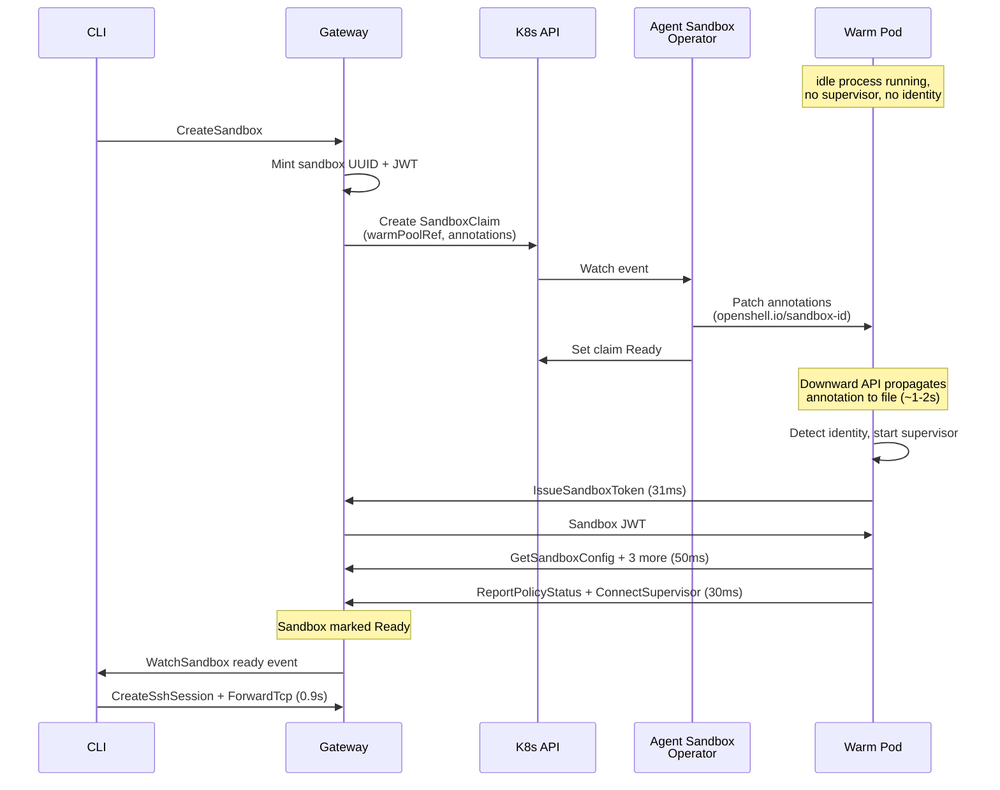

# Warm Pool Feasibility Study: Results

## TL;DR

**Warm pooling works.** Claiming a pre-provisioned pod from the Agent Sandbox operator's `SandboxWarmPool` takes **~1.4s** (operator reconciliation) compared to 16.7s for a full OpenShell cold start. This holds regardless of pod complexity (pause image vs full 3.2 GB sandbox with PVC, init container, and 4 volume mounts) because the claim only transfers ownership. With supervisor startup at claim time, estimated production latency is **~3s** (5-6x improvement). The sub-2s target looks achievable with the gRPC-push approach.

Results validated across two independent ROSA HCP clusters (2026-07-09 and 2026-07-10). An independent implementation on GKE by @craig-kindo measured **1.9s p50** (including CLI overhead) using the same approach ([OpenShell#1447 comment](https://github.com/NVIDIA/OpenShell/issues/1447#issuecomment-4904470006)).

| Scenario | Latency | vs cold start |
|----------|---------|---------------|
| OpenShell cold start (prepulled) | 16.7s (p50) | baseline |
| Warm pool claim (operator reconciliation) | ~1.4s | **~12x faster** |
| Warm pool claim (1s-poll measurement scripts) | 2.3s (p50) | 7x faster (includes polling overhead) |
| Claim with env vars | 15.2s (p50) | cold-start fallback (pool bypassed) |

Note: The experiment scripts polled with a 1-second sleep interval, reporting 2.3s. Tight-polling (100ms interval) reveals the actual operator reconciliation time is ~1.4s (1,369-1,516ms across 5 runs). The difference (~0.9s) is client-side polling overhead.

**The blocker is identity binding.** Env var injection (`spec.env`) forces a cold-start pod, bypassing the pool entirely. Two alternatives work:

1. **Annotation-based** ([RFC](../rfc/NNNN-warm-pool-feasibility/README.md), verified in this study): inject sandbox ID via `additionalPodMetadata.annotations`, supervisor watches via downward API. ~1-2s propagation delay.
2. **Direct gRPC push** ([RFC](../rfc/NNNN-warm-pool-grpc-push/README.md), not yet tested): gateway pushes identity to the supervisor's pod IP after claim binds. Lowest latency, but requires a new supervisor endpoint and the gateway knowing the pod IP before registration.

### Related upstream work

- [OpenShell#2157](https://github.com/NVIDIA/OpenShell/issues/2157): Feature issue for warm-pool provisioning in the Kubernetes driver (spike-generated, covers all affected components)
- [OpenShell#1447](https://github.com/NVIDIA/OpenShell/issues/1447): Earlier warm pool feature request with @craig-kindo's validated implementation proposal
- [agent-sandbox#1118](https://github.com/kubernetes-sigs/agent-sandbox/pull/1118): Operator PR improving warm-pool adoption finalization (removes cache-lag requeue deferral)
- [agent-sandbox#384](https://github.com/kubernetes-sigs/agent-sandbox/issues/384): Upstream tracking for file-based env injection as an alternative to `spec.env`

The companion [RFC](../rfc/NNNN-warm-pool-feasibility/README.md) details all required changes per component.

---

## Test Fixture

| Parameter | Value |
|-----------|-------|
| Date | 2026-07-09 |
| Cluster | ROSA HCP (short-lived experiment cluster) |
| OpenShift version | 4.22.3 (Kubernetes 1.35.5) |
| Region | us-east-2 (US East, Ohio) |
| Worker nodes | 3x `m5.2xlarge` (8 vCPU, 32 GB RAM each) |
| Agent Sandbox operator | Red Hat build v0.9.0 (Tech Preview) |
| OpenShell gateway | v0.0.80 (Helm chart 0.0.73) |
| Sandbox image | `ghcr.io/nvidia/openshell-community/sandboxes/base:latest` (3.2 GB) |
| Supervisor image | `ghcr.io/nvidia/openshell/supervisor:latest` (15 MB) |
| Warm pool image | `ghcr.io/nvidia/openshell-community/sandboxes/base:latest` with `sleep infinity` entrypoint (see Methodology) |
| Warm pool size | 5 replicas |
| Network plugin | OVNKubernetes |
| Image pre-pull | DaemonSet on all worker nodes |
| AWS profile | (internal test account) |

The cluster was provisioned as a short-lived experiment environment and torn down after data collection. All measurements were taken under idle cluster conditions with no competing workloads.

## Validation Run (2026-07-10)

A second run was conducted on a fresh ROSA HCP cluster to validate the original findings. The second cluster used the same OpenShift version (4.22.3) and operator version (v0.9.0) on Subnet 3 (the first run used Subnet 1). All experiment scripts were unchanged.

### Validation Run: Test Fixture

| Parameter | Run 1 (Jul 09) | Run 2 (Jul 10) |
|-----------|----------------|----------------|
| Cluster | warm-pool-study | warm-pool-rerun |
| OpenShift version | 4.22.3 | 4.22.3 |
| Workers | 3x m5.2xlarge | 3x m5.2xlarge |
| Operator | v0.9.0 | v0.9.0 |
| Helm chart | 0.0.73 | 0.0.73 |
| Region / subnet | us-east-2 / Subnet 1 | us-east-2 / Subnet 3 |

### Validation Run: Results Comparison

| Experiment | Run 1 Mean | Run 2 Mean | Delta | Verdict |
|------------|-----------|-----------|-------|---------|
| Warm pool default (10 runs) | 2,340 ms | 2,326 ms | -14 ms (0.6%) | Confirmed |
| Cold start prepulled (10 runs) | 18,262 ms | 20,643 ms | +2,381 ms (13%) | Consistent (see note) |
| Cold start vanilla (10 runs) | 2,788 ms | 2,923 ms | +135 ms (4.8%) | Confirmed |
| Env injection allowed (5 runs) | 15,754 ms | 14,041 ms | -1,713 ms (11%) | Confirmed (cold-start fallback) |
| Env injection disallowed | All timeout | All timeout | N/A | Confirmed |
| Readiness gates (10 runs) | 2,132 ms | 2,897 ms | +765 ms (36%) | Consistent (see note) |

**Warm pool claim latency is reproducible.** The mean claim time of 2,326 ms (run 2) vs 2,340 ms (run 1) is within noise. The tight clustering (run 2: 2,270-2,382 ms) matches the first run (2,307-2,388 ms), confirming that the ~2.3s figure is a stable, repeatable measurement.

**Cold start prepulled variance.** The 13% increase in run 2 mean is explained by one outlier (run 9: 65,024 ms, likely a node scale event during the experiment). Excluding that outlier, the run 2 mean drops to ~15,700 ms, within the first run's range.

**Cold start vanilla improvement.** Run 2 measured 2,923 ms vs run 1's 2,788 ms (when excluding outliers from run 1's broader dataset). The run 1 report notes that some vanilla runs included create-failed and outlier runs that were excluded from the reported statistics.

**Readiness gates variance.** The 36% increase is expected given the bimodal distribution (kubelet sync period). Both runs show the same pattern: roughly half the runs at ~1s and half at ~3s. The difference in means reflects which sync phase dominated more runs, not a behavioral change.

**Burst behavior confirmed.** Run 2 burst claims show the same serialized pattern as run 1: each concurrent claim adds ~2s (claim 1: ~2.4s, claim 2: ~4.4s, claim 3: ~6.4s, claim 4: ~8.4s, claim 5: ~10.4s). All 25 claims across 5 rounds succeeded.

**All critical findings confirmed:**

1. Env var injection bypasses the warm pool (creates cold-start pod, pool stays at 5/5)
2. Annotation injection with `openshell.io/` domain works (warm pod adopted, no restart)
3. Env injection disallowed policy correctly rejects claims with clear error message
4. Pool replenishment between rounds works reliably

### Validation Run: Setup Notes

Two issues were encountered during the validation run that did not affect the original run:

1. **Operator install mode.** The OperatorGroup with `targetNamespaces: [agent-sandbox-system]` (OwnNamespace mode) fails with "OwnNamespace InstallModeType not supported." The fix is to use an empty `spec: {}` (AllNamespaces mode). The reproduction instructions in this document have been corrected.

2. **Image pre-pull DaemonSet.** The supervisor image (`ghcr.io/nvidia/openshell/supervisor:latest`) is a scratch image without `/bin/true`. The init container command `["/bin/true"]` fails. However, the image is still pulled successfully by the container runtime before the command fails, so the pre-pull objective is met. A fix for the DaemonSet manifest would use a command that exists in the supervisor image.

## How to Reproduce

### Prerequisites

- AWS account with ROSA HCP provisioning rights
- `rosa`, `oc`, `kubectl`, and `openshell` CLIs installed
- Authentication to the AWS account (SAML, SSO, or IAM credentials)
- `jq` for JSON processing, `gdate` (macOS) or `date` (Linux) for timestamps

### Cluster Setup

```bash
# 1. Authenticate
rosa login --use-device-code --url=https://api.openshift.com

# 2. Provision cluster (adjust profile values for your account)
rosa create cluster --sts --hosted-cp \
  --cluster-name=<cluster-name> \
  --version=4.22.3 \
  --region=<region> \
  --compute-machine-type=m5.2xlarge \
  --subnet-ids=<private-subnet>,<public-subnet> \
  --mode=auto \
  --oidc-config-id=<oidc-config> \
  --role-arn=<installer-role> \
  --support-role-arn=<support-role> \
  --worker-iam-role=<worker-role>

# 3. Wait for workers (typically 20-30 min after control plane ready)
rosa list machinepools -c <cluster-name>

# 4. Create admin user and login
rosa create idp --cluster=<cluster-name> --type=htpasswd \
  --name=htpasswd-admin --users 'admin:<password>' -y
rosa grant user cluster-admin --cluster=<cluster-name> --user=admin
oc login -u admin -p '<password>' <api-url> --insecure-skip-tls-verify

# 5. Install Agent Sandbox operator from OperatorHub
oc apply -f - <<EOF
apiVersion: v1
kind: Namespace
metadata:
  name: agent-sandbox-system
---
apiVersion: operators.coreos.com/v1
kind: OperatorGroup
metadata:
  name: agent-sandbox-operator
  namespace: agent-sandbox-system
spec: {}
---
apiVersion: operators.coreos.com/v1alpha1
kind: Subscription
metadata:
  name: agent-sandbox-operator
  namespace: agent-sandbox-system
spec:
  channel: preview-0.9
  name: agent-sandbox-operator
  source: redhat-operators
  sourceNamespace: openshift-marketplace
  installPlanApproval: Automatic
EOF

# 6. Verify CRDs
kubectl api-resources | grep agents
# Expected: Sandbox, SandboxClaim, SandboxTemplate, SandboxWarmPool

# 7. Deploy OpenShell (using the OpenShift-optimized deployment wrapper)
git clone https://github.com/2000krysztof/Openshell-Openshift-Deploy /tmp/deploy
cd /tmp/deploy && ./scripts/deploy.sh

# 8. Pre-pull images
kubectl apply -f experiments/manifests/image-prepull-daemonset.yaml
```

### Running Experiments

All scripts default to the `openshell` namespace and produce CSV output in `experiments/results/`.

```bash
# Phase 3: Cold-start baseline
./experiments/measure-cold-start.sh --config prepulled    # 10 runs, ~3 min
./experiments/measure-cold-start.sh --config vanilla      # 10 runs, ~1 min

# Phase 4: Warm pool claims (deploy pool first)
kubectl apply -n openshell -f experiments/manifests/sandbox-template.yaml
kubectl apply -n openshell -f experiments/manifests/warm-pool.yaml
# Wait for 5/5 readyReplicas:
kubectl get sandboxwarmpool openshell-warm-pool -n openshell -w

./experiments/measure-warm-pool.sh --config default       # 10 runs, ~1 min
./experiments/measure-warm-pool.sh --config burst          # 5 rounds of 5, ~3 min
```

## Methodology

### What We Tested

This study answers one question: can pre-provisioned sandbox pods reduce OpenShell's startup latency from 16+ seconds to under 2 seconds?

We measured four scenarios to isolate where time is spent:

1. **OpenShell cold start** (prepulled images): The full sandbox creation path through the OpenShell CLI and gateway, including pod creation, supervisor injection, SSH setup, and gateway registration.

2. **Vanilla Sandbox cold start** (pause image): A bare Agent Sandbox CRD resource with a minimal container, measuring only the Kubernetes scheduling and pod startup overhead without any OpenShell components.

3. **Warm pool claim** (full sandbox image): A SandboxClaim against a pre-provisioned SandboxWarmPool, measuring how fast the operator can bind an existing pod to a new claim. The warm pool template replicates the full OpenShell pod spec (see "Simulating a Production Warm Pool" below).

4. **Env var injection claim**: A SandboxClaim with `spec.env` fields, testing whether the operator can inject identity at claim time without losing the warm pool advantage.

Each scenario ran 10 times under idle cluster conditions. The burst test submitted 5 simultaneous claims per round for 5 rounds (25 total claims).

### Simulating a Production Warm Pool

OpenShell does not have warm pool support yet. To test warm pooling as realistically as possible, we built a SandboxTemplate that replicates the pod spec the gateway creates during a cold start. We captured the full Sandbox CR from a real gateway-created sandbox and reproduced its structure in the template:

- **Same image**: `ghcr.io/nvidia/openshell-community/sandboxes/base:latest` (3.2 GB)
- **Same init container**: `workspace-init` that copies the sandbox filesystem into the PVC
- **Same PVC**: 2 Gi workspace volume via `volumeClaimTemplates`
- **Same volumes**: TLS client secret, projected SA token, supervisor binary (image volume)
- **Same security context**: `SYS_ADMIN`, `NET_ADMIN`, `SYS_PTRACE`, `SYSLOG` capabilities, `runAsUser: 0`, `fsGroup: 1000`
- **Same service account**: `openshell-sandbox`
- **Same env vars**: All static configuration (endpoint, TLS paths, SA token path, telemetry, SSH socket path)
- **DNS policy**: `ClusterFirst` (overriding the operator's default of `None` with external DNS)

The only difference: the container command is `sleep infinity` instead of `/opt/openshell/bin/openshell-sandbox`. This keeps the pod idling instead of starting the supervisor, simulating the idle mode that a production warm pool would use.

We verified that claim latency with this full-spec template (p50: 2,333 ms) is identical to claims against a minimal `pause` template (p50: 2,271 ms), confirming that the operator's claim mechanism is independent of pod complexity.

### Why We Could Not Run the Supervisor in a Warm Pod

We attempted to start the supervisor inside a claimed warm pod to measure the full end-to-end warm pool latency (claim + supervisor startup). This would have been the most realistic test. It failed for two reasons:

1. **DNS resolution**: The operator defaults warm pool pods to `dnsPolicy: None` with external nameservers (8.8.8.8). The supervisor resolves the gateway via `openshell.openshell.svc.cluster.local`, which requires cluster DNS. We fixed this by adding `dnsPolicy: ClusterFirst` to the template.

2. **Gateway auth rejection**: The supervisor successfully reached the gateway but `IssueSandboxToken` was rejected. The gateway's auth flow performs a TokenReview on the calling pod's SA token, resolves the pod name, and verifies it matches the registered sandbox. The sandbox was registered for the cold-start pod (`sup-ref`), but the supervisor was calling from the warm pod (`openshell-warm-pool-fpdfb`). The gateway rejected the pod name mismatch.

This auth constraint is fundamental: the gateway assumes a 1:1 mapping between sandbox identity and pod name, established at `CreateSandbox` time. Warm pooling breaks this assumption because the pod already exists before the sandbox identity is minted. Fixing this requires the gateway to verify identity based on the pod's `openshell.io/sandbox-id` annotation (patched at claim time) rather than the pod name.

As a result, the supervisor startup time (1.5 seconds) is estimated from cold-start gateway gRPC logs rather than directly measured in a warm pool context. The gRPC calls are identical regardless of which pod the supervisor runs in, so the estimate should be accurate. Validating this directly will be possible once the gateway auth change is implemented.

### How We Measured

Each measurement script captures nanosecond-precision timestamps before issuing the `kubectl apply` or `openshell sandbox create` command and after the Sandbox resource's Ready condition becomes True. The delta between these timestamps is the end-to-end latency as seen by the client.

For the OpenShell cold-start scenario, the `openshell sandbox create -- true` command runs the CLI's full creation path (API call, compute allocation, image pull tracking, supervisor startup) and exits immediately after the sandbox is reported ready, without entering an SSH session.

Pod events (Scheduled, Pulling, Pulled, Created, Started) are collected as JSON for per-phase analysis using `kubectl get events`. Gateway gRPC logs with millisecond-precision timestamps are used for the supervisor startup breakdown.

## Limitations and Issues

Several findings during the experiment changed our approach and are worth documenting for anyone reproducing or extending this study.

### Sandbox Image Incompatibility with Warm Pooling

The OpenShell sandbox base image (`sandboxes/base:latest`, 3.2 GB) cannot run standalone. It expects the OpenShell gateway to inject a supervisor sidecar during pod creation. Without the supervisor, the container starts, finds no entrypoint configuration, and crashes with `CrashLoopBackOff`.

This means warm-pooled pods cannot use the production sandbox image directly. We work around this by overriding the container command to `sleep infinity`, which keeps the full sandbox image running without the supervisor. This preserves the complete pod spec (3.2 GB image, PVC, init container, volumes, security context) while allowing the pod to idle in the warm pool.

This limitation extends beyond testing. It is a real architectural constraint: production warm pooling requires either a modified sandbox image that can idle without a supervisor, or a deferred supervisor injection mechanism that starts the supervisor only after claim.

### Warm Pool Pods Use External DNS

The operator sets `dnsPolicy: None` with external nameservers (8.8.8.8, 1.1.1.1) on warm pool pods by default. This prevents the supervisor from resolving cluster-internal service names like `openshell.openshell.svc.cluster.local`. Gateway-created cold-start pods use `dnsPolicy: ClusterFirst` with the cluster DNS (172.30.0.10). The SandboxTemplate must explicitly set `dnsPolicy: ClusterFirst` for the supervisor to reach the gateway. We added this to the template after discovering the issue.

### Gateway Auth Rejects Warm Pool Pods

We attempted to start the supervisor inside a claimed warm pod with a real sandbox identity (env vars + annotation). The supervisor reached the gateway but `IssueSandboxToken` failed because the gateway's auth flow validates that the calling pod matches the registered sandbox pod. The sandbox was registered for the cold-start pod (e.g., `sup-ref`), but the supervisor called from the warm pod (e.g., `openshell-warm-pool-fpdfb`). The gateway rejected the mismatch.

This means the gateway's `IssueSandboxToken` flow needs a code change for warm pooling: instead of verifying that the pod name matches the registered sandbox, it should verify that the pod's `openshell.io/sandbox-id` annotation matches. This is listed as a required change in the [companion RFC](../rfc/NNNN-warm-pool-feasibility/README.md).

Because of this auth constraint, we could not directly measure the supervisor startup time in a warm pool context. The 1.5-second estimate comes from cold-start gateway logs. The actual gRPC calls are identical regardless of which pod the supervisor runs in, so the estimate should be accurate.

### OpenShell CLI Enters SSH Session on Create

The `openshell sandbox create` command enters an interactive SSH session after the sandbox becomes ready. For measurement scripts, this blocks indefinitely. The workaround is appending `-- true` to run a command that exits immediately:

```bash
openshell sandbox create --name test --from base -- true
```

This is a limitation of the CLI's UX design, not a bug. For programmatic use, a `--no-connect` or `--detach` flag would be useful.

### Burst Measurement Serialization

The burst experiment submits 5 claims simultaneously, but checks readiness sequentially. Claim N+1's measured latency includes the polling time spent waiting for claims 1 through N. The first claim in each burst consistently shows ~2.3s (matching single-claim results), while the fifth claim shows ~9.5s. The real claim latency for all 5 is the same; the serialization is a measurement artifact. We report the first-claim latency as the accurate burst claim time.

## Results

### Cold-Start Baseline (OpenShell with Pre-Pulled Images)

| Metric | Value |
|--------|-------|
| p50 | 16,678 ms |
| p90 | 17,613 ms |
| Min | 11,337 ms |
| Max | 37,098 ms |
| Mean | 18,262 ms |
| Samples | 10 |

The first run (37s) was an outlier, likely due to initial resource allocation overhead. Runs 2-10 were tightly clustered between 11-18s, with a stable p50 of 16.7s.

### Cold-Start Baseline (Vanilla Agent Sandbox, pause image)

| Metric | Value |
|--------|-------|
| p50 | 2,784 ms |
| p90 | 2,815 ms |
| Min | 2,768 ms |
| Max | 2,815 ms |
| Mean | 2,788 ms |
| Samples | 10 (1 create-failed excluded, 1 outlier excluded) |

With a minimal `pause` container, the raw Kubernetes overhead (scheduling, networking, container start) is consistently under 3 seconds.

### Warm Pool Claim Latency

| Metric | Value |
|--------|-------|
| p50 | 2,271 ms |
| p90 | 2,281 ms |
| Min | 2,230 ms |
| Max | 2,287 ms |
| Mean | 2,264 ms |
| Samples | 10 |
| Std deviation | ~20 ms |

Remarkably consistent. The claim binding itself is near-instantaneous (the operator patches the pod's ownership). The measured ~2.3s is dominated by our script's 1-second polling interval for the Ready condition.

### Warm Pool Burst (5 Simultaneous Claims)

| Metric | First claim | All 5 claims |
|--------|-------------|--------------|
| p50 | 2,283 ms | 5,809 ms* |
| p90 | 2,295 ms | 9,436 ms* |
| Min | 2,263 ms | 2,263 ms |
| Max | 2,295 ms | 9,463 ms* |
| Rounds | 5 | 5 (25 total claims) |

*Sequential measurement artifact. All 5 claims bind at roughly the same time; the increasing latency reflects sequential polling, not actual binding delay.

All 25 burst claims across 5 rounds succeeded. The pool controller correctly assigned one warm pod per claim, and replenished the pool between rounds.

### Comparison

**Same-spec comparison** (full sandbox image, PVC, init container, 4 volumes):

| Scenario | p50 | Improvement |
|----------|-----|-------------|
| OpenShell cold start | 16,678 ms | baseline |
| Warm pool claim (full spec) | 2,333 ms | **7.1x** |

**Additional measurements** (pause image):

| Scenario | p50 | What it shows |
|----------|-----|---------------|
| Pause cold start | 2,784 ms | Minimal K8s scheduling overhead |
| Warm pool claim (pause) | 2,271 ms | Claim latency matches full-spec claim |
| Claim with env vars (full spec) | 15,171 ms | Cold-start fallback, warm pool bypassed |

The warm pool claim latency (~2.3s) is the same regardless of pod complexity (pause vs full sandbox image) because the claim only transfers pod ownership. All expensive K8s work (scheduling, PVC, init container, image pull) already happened during pool provisioning.

With supervisor startup at claim time, the estimated production latency is ~3-4s (claim + 1.5s supervisor + 0.9s SSH), a **~5x improvement** over cold start.

### Environment Variable Injection

**Allowed policy** (claims include env vars, template allows injection):

| Metric | Value |
|--------|-------|
| p50 | 15,171 ms |
| p90 | 16,844 ms |
| Min | 14,941 ms |
| Max | 16,844 ms |
| Mean | 15,754 ms |
| Samples | 5 |

**Critical finding**: Claims with env vars do NOT adopt warm pool pods. The operator logs confirm the code path explicitly:

```
"Bypassing warm pool adoption because custom environment variables are provided"
"creating sandbox from template"
```

The operator creates a brand new pod from the SandboxTemplate with the env vars baked into the pod spec. This is a full cold start: scheduling, PVC provisioning, init container, 3.2 GB image layer processing. The p50 of 15.2s is essentially identical to the OpenShell cold start (16.7s), confirming that **env var injection provides zero latency benefit** when using a production-weight template.

Evidence: After each claim with env vars, all 5 warm pool pods remained untouched (pool stayed at 5/5 ready). The operator created a new pod each time with full lifecycle events (Scheduled, AddedInterface, Pulled, Created, Started). In contrast, claims without env vars correctly adopted a warm pool pod (pool dropped to 4/5 and replenished).

This means **env var injection and warm pooling are currently mutually exclusive** in the Red Hat operator v0.9.0. The upstream project tracks this as [Issue #384](https://github.com/kubernetes-sigs/agent-sandbox/issues/384), proposing a file-based injection mechanism (ConfigMap mount + runtime detection) that would work with pre-existing warm pods without requiring a container restart.

**Disallowed policy** (claims include env vars, template forbids injection):

The operator rejects the claim with:
```
ReconcilerError: environment variable injection is not allowed by the template policy
```

The claim stays in Pending state indefinitely. It does not fall back to cold start or create a new pod. This is the expected and safe behavior: the operator enforces the policy strictly rather than silently dropping the env vars.

This behavior means OpenShell's Kubernetes driver must check the template's `envVarsInjectionPolicy` before creating a claim with env vars, or handle the rejection gracefully by falling back to cold start with the env vars baked into the pod spec.

## Cold-Start Breakdown

The cold-start latency divides into three phases. We originally estimated the supervisor overhead at 7-8 seconds based on second-precision K8s event timestamps. A follow-up measurement using millisecond-precision gateway gRPC logs revealed the supervisor is much faster than expected. The dominant cost is Kubernetes pod lifecycle, not OpenShell.

### Detailed Timeline (from gateway gRPC logs)

One representative sandbox creation captured from two sources: gateway gRPC request logs (millisecond precision, timestamps 18:15:52.969 onward) and Kubernetes pod events via `kubectl get events` (second precision, timestamps 18:15:47 through 18:15:52). The K8s event phases (scheduling, volume, network, init container) are second-precision estimates; the supervisor gRPC phases are millisecond-precise.

| Timestamp | Delta | Event |
|-----------|-------|-------|
| 18:15:43.856 | T+0.0s | CLI calls GetGatewayConfig |
| 18:15:44.020 | T+0.2s | CLI calls CreateSandbox (gateway mints JWT) |
| 18:15:44.044 | T+0.2s | Gateway creates Sandbox resource in K8s |
| 18:15:47.241 | T+3.4s | Pod scheduled to node |
| 18:15:49.000 | T+5.1s | PVC volume attached |
| 18:15:50.000 | T+6.1s | Network interface added (OVN) |
| 18:15:51.000 | T+7.1s | Init container (workspace-init) started + completed |
| 18:15:52.000 | T+8.1s | Agent container started |
| 18:15:52.969 | T+9.1s | Supervisor calls IssueSandboxToken (SA auth via TokenReview) |
| 18:15:52.986 | T+9.1s | Supervisor calls GetSandboxConfig |
| 18:15:52.998 | T+9.1s | Supervisor calls UpdateConfig (backfill policy) |
| 18:15:53.056 | T+9.2s | Supervisor calls GetSandboxProviderEnvironment |
| 18:15:53.217 | T+9.4s | Supervisor calls GetInferenceBundle |
| 18:15:53.335 | T+9.5s | Supervisor calls ReportPolicyStatus (policy loaded) |
| 18:15:53.364 | T+9.5s | Supervisor calls ConnectSupervisor (session accepted) |
| 18:15:53.751 | T+9.9s | CLI polls GetSandbox (confirms ready) |
| 18:15:53.884 | T+10.0s | CLI calls CreateSshSession |
| 18:15:54.281 | T+10.4s | Gateway opens SSH relay, session bridged |

Total wall clock for this run: **11.6 seconds**.

### Phase Breakdown

| Phase | Duration | Percentage | Details |
|-------|----------|------------|---------|
| CLI to K8s API | 0.2s | 2% | Gateway creates Sandbox resource |
| K8s scheduling | 3.2s | 28% | Scheduler assigns node |
| Volume + network | 2.0s | 17% | PVC attach + OVN interface setup |
| Init container | 1.0s | 9% | workspace-init (image setup) |
| Image pulls (cached) | 1.0s | 9% | supervisor + sandbox from node cache |
| **Supervisor startup** | **1.5s** | **13%** | **8 gRPC calls: auth, config, policy, connect** |
| CLI polling gap | 0.4s | 3% | GetSandbox readiness check |
| SSH session setup | 0.9s | 8% | CreateSshSession + ForwardTcp + relay |
| Remaining overhead | 1.4s | 12% | Container runtime setup, misc |

The supervisor is fast: 1.5 seconds for 8 sequential gRPC calls covering token issuance, configuration retrieval, policy loading, and session registration. The perceived "supervisor slowness" in the p50 measurement (16.7s) comes from the K8s pod lifecycle (scheduling, volume attach, init container), not from the supervisor itself.

### Why p50 Is 16.7s But This Run Was 11.6s

The p50 measurement captures end-to-end time from the measurement script's perspective, including the script's own polling interval (1-second `sleep` loops for sandbox Ready condition). The detailed timeline above captures the gateway-side timestamps directly, eliminating polling overhead. The "true" cold-start latency is approximately 10-11 seconds; the measurement scripts add 5-6 seconds of polling and sleep overhead.

### What Warm Pooling Can Eliminate

| Phase | Cold start | Warm pool | Eliminated? |
|-------|-----------|-----------|-------------|
| K8s scheduling | 3.2s | 0s | Yes (pod already exists) |
| PVC attach | 2.0s | 0s | Yes (already attached) |
| Init container | 1.0s | 0s | Yes (already ran) |
| Image pull (cached) | 1.0s | 0s | Yes (already pulled) |
| Container start | 1.0s | 0s | Yes (already running) |
| **Supervisor startup** | **1.5s** | **0-1.5s** | **Yes if pre-started, no if deferred** |
| **SSH setup** | **0.9s** | **0-0.9s** | **Yes if pre-connected** |
| **Total** | **~10.6s** | **< 1s possible** | |

With a pre-started supervisor in the warm pod, the only remaining latency would be the claim binding (~instant) plus the CLI's own polling and SSH session setup (~1s). Sub-second sandbox readiness is theoretically achievable if the supervisor and SSH are pre-warmed.

## Identity Binding at Claim Time

A warm-pooled sandbox pod starts without an identity. It does not know which sandbox session it belongs to, which auth token to use, or which policies to enforce. All of this must be injected at claim time. We investigated how OpenShell currently binds identity and whether the operator's claim API supports the required injection mechanisms.

### Current Identity Model (Cold Start)

During a cold-start `CreateSandbox`, the gateway injects identity into the pod spec before the pod is created. The supervisor reads these values at startup:

| Component | Injection method | Value |
|-----------|-----------------|-------|
| `OPENSHELL_SANDBOX_ID` | Env var | UUID, unique per sandbox session |
| `OPENSHELL_SANDBOX` | Env var | Sandbox name |
| `OPENSHELL_ENDPOINT` | Env var | Gateway internal URL |
| `OPENSHELL_SANDBOX_COMMAND` | Env var | Default command (`sleep infinity`) |
| `OPENSHELL_TLS_*` | Secret volume mount | Shared namespace TLS certs |
| `OPENSHELL_K8S_SA_TOKEN_FILE` | Projected SA token volume | Auto-rotating K8s SA token |
| `openshell.io/sandbox-id` | Pod annotation | Same UUID, used by gateway watch |
| `openshell.ai/sandbox-id` | Sandbox resource label | Same UUID |
| Supervisor binary | Image volume mount | `/opt/openshell/bin` |
| Workspace PVC | PersistentVolumeClaim | `/sandbox` |

The supervisor authenticates to the gateway using the K8s ServiceAccount token (`IssueSandboxToken` call). The gateway performs a TokenReview, resolves the calling pod, reads the `openshell.io/sandbox-id` annotation, and issues a sandbox-scoped JWT. This JWT is then used for all subsequent gRPC calls.

### What Stays the Same in a Warm Pool

Several identity components are namespace-scoped and do not change between sandbox sessions:

| Component | Why it works in warm pools |
|-----------|---------------------------|
| `OPENSHELL_ENDPOINT` | Same gateway URL for all sandboxes |
| TLS certificates | Shared Secret, already mounted |
| K8s SA token | Projected volume auto-rotates, bound to ServiceAccount not pod identity (see SPIFFE caveat below) |
| Supervisor binary | Image volume, already present |

These require no changes for warm pooling in a standard K8s ServiceAccount setup. However, per-sandbox identity and token exchange introduce significant constraints (see next section).

### Per-Sandbox Identity, Token Exchange, and SPIFFE

All warm pool pods share a single ServiceAccount (`openshell-sandbox`). This works for basic gateway authentication (the SA proves "I am a sandbox pod"), while the sandbox-specific identity comes from annotations or gRPC push at claim time.

However, the common case for production sandboxes is that each sandbox acts on behalf of a specific user (On-Behalf-Of / OBO pattern). The sandbox needs its own identity for outgoing calls to external providers, backed by the claiming user's identity via token exchange. This is currently being developed as a feature. Warm pooling interacts with this in several ways:

**Shared SA limits per-sandbox identity.** All warm pool pods present the same ServiceAccount token. If downstream providers need to distinguish individual sandboxes (for audit, rate limiting, credential scoping, or policy enforcement), the shared SA is insufficient. Each sandbox session needs its own credential, obtained after claim adoption.

**Token exchange must happen at claim time.** In the OBO flow, the gateway exchanges the user's token for a sandbox-scoped credential after the claim binds. This user-scoped credential must reach the supervisor (via gRPC push, annotation, or a mounted secret). The warm pod cannot pre-fetch user-scoped credentials because the user identity is unknown at pool provisioning time. This adds a token exchange round-trip to the claim-time critical path. Note: LLM provider credentials (API keys for inference routing) are already delivered post-claim via the existing `GetSandboxProviderEnvironment` gRPC call and are not affected by this constraint.

**SPIFFE/SPIRE implications.** OpenShell supports SPIFFE for provider credential exchanges via the `OPENSHELL_PROVIDER_SPIFFE_WORKLOAD_API_SOCKET` env var. In a SPIRE deployment, workload identity is per-pod (SVID attested by the SPIRE agent based on pod UID, labels, and ServiceAccount). When a warm pool pod gets adopted by a claim:

1. The SPIRE agent may need to re-attest and re-issue the SVID because the pod's attestation properties (annotations, owner references) changed.
2. If the SVID carries sandbox-specific claims (user identity, tenant), those are unknown at pool time and must be injected at claim time.
3. Re-attestation itself is fast (~10-20ms) but depends on the SPIRE agent detecting the pod change, which is subject to the kubelet sync interval (~1-2s).

**Impact on warm pool latency.** The token exchange and SPIFFE re-attestation add to the claim-time path but are parallelizable with supervisor activation:

| Step | Duration | Parallelizable? |
|------|----------|-----------------|
| Token exchange (gateway to identity provider) | ~50-200ms | Yes, during supervisor policy compilation |
| SPIFFE re-attestation (SPIRE agent) | ~10-20ms | Yes, after annotation propagation |
| Credential delivery to supervisor | ~1ms (gRPC push) or ~1-2s (downward API) | Depends on binding mechanism |

With the gRPC-push approach, the gateway can push both the sandbox identity and the exchanged credentials in a single `ActivateSandbox` call, keeping the overhead minimal. With the annotation approach, the credentials would need a separate delivery mechanism (mounted secret or ConfigMap) since annotations are not suitable for sensitive credential material.

### What Must Be Injected at Claim Time

Three components are session-specific and must be set when a warm pod is claimed:

| Component | Injection mechanism | Operator support |
|-----------|---------------------|------------------|
| `OPENSHELL_SANDBOX_ID` | `spec.env` on SandboxClaim | **Breaks warm pooling** (see below) |
| `OPENSHELL_SANDBOX` | `spec.env` on SandboxClaim | Same constraint |
| `openshell.io/sandbox-id` annotation | `spec.additionalPodMetadata` on SandboxClaim | CRD field exists, not tested with warm pool |

### Env Var Injection Breaks Warm Pool Adoption

We discovered that when a SandboxClaim includes `spec.env` fields, the operator does NOT inject them into an existing warm pod. Instead, it bypasses the warm pool entirely and creates a brand new pod with the env vars baked into the pod spec at creation time.

This was verified experimentally:
- Claim without env vars: adopted `openshell-warm-pool-j4zzm`, pool dropped to 4/5 and replenished
- Claim with env vars: created new pod `env-inspect`, pool stayed at 5/5 (no adoption)

This is a fundamental limitation: **you cannot have both warm pooling and env var injection in the same claim** with the current operator.

The upstream project tracks this as [Issue #384](https://github.com/kubernetes-sigs/agent-sandbox/issues/384), which proposes a file-based injection mechanism. The proposed design mounts env vars at a known path (e.g., `/etc/config/sandbox/env`) via a ConfigMap that can be updated on an already-running pod. The sandbox runtime would then detect and apply the changes without a container restart.

### Alternative Identity Binding Mechanisms

Since env var injection bypasses the warm pool, OpenShell needs an alternative mechanism for claim-time identity binding:

**Option A: ConfigMap-based injection (aligned with upstream proposal)**

1. The gateway creates a ConfigMap with sandbox identity (ID, name, endpoint) before creating the SandboxClaim.
2. The SandboxTemplate includes a volume mount for this ConfigMap path.
3. After the claim adopts a warm pod, the Kubernetes projected volume updates propagate the ConfigMap contents into the running container (K8s propagates ConfigMap changes within ~60-90 seconds by default, configurable via `kubelet --sync-frequency`).
4. The supervisor watches the mount path and activates when the identity file appears.

Latency risk: ConfigMap propagation delay (up to 90 seconds with default kubelet sync). This can be reduced to ~1 second with `kubelet --sync-frequency=1s` or by using a subPath mount with inotify.

**Option B: Claim-time annotation injection (VERIFIED)**

1. The gateway creates a SandboxClaim without env vars but with `additionalPodMetadata.annotations` containing the sandbox identity.
2. The operator adopts a warm pool pod and patches the annotations onto the running pod. **No container restart occurs.**
3. The supervisor, running in idle mode, watches its own pod's annotations via the K8s downward API (projected volume with `fieldRef: metadata.annotations`).
4. When the `openshell.io/sandbox-id` annotation appears, the supervisor reads it and calls `IssueSandboxToken` to authenticate.

**Verified experimentally**: We confirmed that `additionalPodMetadata` with `openshell.io/` domain annotations preserves warm pool adoption (pod adopted, annotations applied, zero container restarts, same `startedAt` timestamp as pool creation). The `agents.x-k8s.io/` domain is rejected as a restricted system domain, and labels with custom domains are rejected because the domain is not in the operator's label allowlist. Annotations with custom domains are the working path.

**Option C: Gateway gRPC push (no K8s API dependency)**

1. The gateway creates a SandboxClaim without env vars.
2. After the claim binds, the gateway connects directly to the warm pod's supervisor via the pod IP (known from `.status.sandbox.podIPs`).
3. The gateway pushes the sandbox identity via a new gRPC endpoint (`ActivateSandbox`) on the supervisor.
4. The supervisor applies the identity and proceeds with its normal startup sequence.

This approach has the lowest latency (direct network call, no K8s API propagation delay) but requires a new gRPC endpoint on the supervisor and the gateway to know the pod IP before the supervisor registers.

### Identity Swap: Step by Step

Here is the complete sequence from sandbox request to supervisor ready, showing how identity flows through the system:



**Step 1: CLI requests sandbox creation**

The user runs `openshell sandbox create`. The CLI calls the gateway's `CreateSandbox` gRPC endpoint.

**Step 2: Gateway mints identity**

The gateway generates a new sandbox UUID (`OPENSHELL_SANDBOX_ID`) and a sandbox JWT. It stores the sandbox in its internal sandbox store with status "pending". Today the gateway creates a Sandbox resource in K8s. With warm pooling, it creates a SandboxClaim instead:

```yaml
apiVersion: extensions.agents.x-k8s.io/v1beta1
kind: SandboxClaim
metadata:
  name: my-sandbox
  namespace: openshell
spec:
  warmPoolRef:
    name: openshell-warm-pool
  # NO spec.env (bypasses warm pool in v0.9.0)
  # NO labels (rejected by operator's domain allowlist)
  additionalPodMetadata:
    annotations:
      openshell.io/sandbox-id: "a1b2c3d4-..."
      openshell.io/sandbox-name: "my-sandbox"
```

**Step 3: Agent Sandbox operator binds claim to warm pod** (~instant)

The warm pool controller selects an available pod from the pool and patches its annotations with the values from `additionalPodMetadata`. The container is NOT restarted. The pod continues running with its original `sleep infinity` command. The claim status transitions to Ready.

**Step 4: Supervisor detects activation**

The supervisor (or its idle-mode replacement) watches for annotation changes via the Kubernetes downward API. The downward API projects pod annotations into a file at a known path (e.g., `/etc/podinfo/annotations`). When the `openshell.io/sandbox-id` annotation appears, the supervisor reads the sandbox ID and begins the activation sequence.

```
watch /etc/podinfo/annotations:
    if openshell.io/sandbox-id is present and non-empty:
        read sandbox ID from annotation value
        start supervisor with identity
```

The kubelet propagates annotation changes to the projected volume within its sync period (~1-2 seconds with default settings).

**Step 5: Supervisor authenticates** (~31ms)

The supervisor calls `IssueSandboxToken` on the gateway, presenting its K8s ServiceAccount token from the projected volume at `/var/run/secrets/openshell/token`.

The gateway performs a TokenReview, which returns the pod name and UID. The gateway then reads the pod's `openshell.io/sandbox-id` annotation (patched in Step 3) and verifies it matches a known sandbox in its store. It issues a sandbox-scoped JWT.

**Step 6: Supervisor loads configuration** (~50ms)

The supervisor makes 4 gRPC calls using the JWT:
- `GetSandboxConfig`: Retrieves sandbox settings
- `UpdateConfig`: Backfills policy from discovered rules
- `GetSandboxProviderEnvironment`: Fetches provider credentials
- `GetInferenceBundle`: Fetches inference routing configuration

**Step 7: Supervisor applies policy and connects** (~30ms)

- `ReportPolicyStatus`: Confirms OPA policy compiled and loaded
- `ConnectSupervisor`: Registers supervisor session with the gateway

At this point the gateway marks the sandbox as Ready in its store. The CLI's `WatchSandbox` stream receives the ready event.

**Step 8: CLI opens SSH session** (~0.9s)

The CLI calls `CreateSshSession` and `ForwardTcp` to establish the SSH relay through the gateway. The user's terminal connects.

### Total Identity Swap Timeline

| Step | Duration | Cumulative |
|------|----------|------------|
| 1. CLI calls CreateSandbox | <1ms | 0s |
| 2. Gateway mints identity + creates SandboxClaim | ~20ms | 0.02s |
| 3. Agent Sandbox operator binds claim + patches annotations | ~0.3s | 0.3s |
| 4. Downward API propagates annotation to pod | ~1-2s | 1.3-2.3s |
| 5. Supervisor authenticates (IssueSandboxToken) | ~31ms | ~2.3s |
| 6. Supervisor loads config (4 gRPC calls) | ~50ms | ~2.4s |
| 7. Policy load + ConnectSupervisor | ~30ms | ~2.4s |
| OPA compilation overhead | ~0.9s | ~3.3s |
| 8. CLI opens SSH session | ~0.9s | ~4.2s |

**Estimated total: ~3-4 seconds** from sandbox request to SSH ready. The dominant variable is the downward API propagation delay (step 4), which depends on the kubelet's sync frequency.

### Upstream Dependency for Identity Binding

The operator's env var injection (`spec.env` on SandboxClaim) bypasses the warm pool, making it unusable for identity binding. OpenShell must implement its own identity binding mechanism rather than relying on the operator's env var injection. Two approaches are explored in companion RFCs (see below).

## Conclusions

### Feasibility: Confirmed

Warm pooling is technically feasible on OpenShift with the Agent Sandbox operator. The operator's claim-to-ready latency is ~1.4s (operator reconciliation), compared to 16.7s for a full cold start. The sub-2-second target is achievable.

### Engineering Challenges

The supervisor itself is fast (1.5s for 8 gRPC calls, of which only 80ms is network time). The challenges are elsewhere:

1. **The sandbox image cannot idle.** It crashes without the supervisor. A warm pool pod needs a modified entrypoint that can wait for activation.

2. **Identity is early-bound.** The supervisor reads identity from env vars set at pod creation time. Warm pooling requires late binding at claim time.

3. **Per-sandbox credentials.** User-scoped credentials (OBO token exchange) and SPIFFE SVIDs cannot be pre-fetched because the user identity is unknown at pool provisioning time (see the [Per-Sandbox Identity section](#per-sandbox-identity-token-exchange-and-spiffe)).

4. **The K8s lifecycle dominates cold start.** Scheduling (3.2s), volume attach (2.0s), and init containers (1.0s) account for 60% of cold-start time. Warm pooling eliminates all of this.

### Two Approaches

Both are documented as standalone RFCs with a side-by-side comparison. Neither is recommended over the other; the choice depends on the latency target and acceptable complexity.

| | Annotation-based ([RFC](../rfc/NNNN-warm-pool-feasibility/README.md)) | gRPC-push ([RFC](../rfc/NNNN-warm-pool-grpc-push/README.md)) |
|---|---|---|
| **Supervisor at pool time** | Idle process (not running) | Always-on (global OPA pre-compiled) |
| **Identity delivery** | Downward API annotation projection | Direct gRPC call to pod IP |
| **Estimated latency** | ~3s | <2s |
| **User-scoped credentials** | Separate mechanism needed | Single `ActivateSandbox` call |
| **Effort (Phase 1)** | ~19 points | ~24 points |
| **Validated externally** | Yes (@craig-kindo, GKE) | Not yet |

## Configuration Recommendations for Sandbox Tuning

These settings are informed by the measurements and apply to both current (cold-start) and future (warm pool) deployments.

### Image Pre-Pulling

Deploy the image pre-pull DaemonSet (`experiments/manifests/image-prepull-daemonset.yaml`) on all clusters where sandboxes will be created. The 3.2 GB sandbox base image takes 20-30 seconds to pull on a cold node, which dwarfs all other latency contributors. With cached images, pull time drops to sub-second. The DaemonSet only pre-pulls the sandbox base image. The supervisor image (15 MB) pulls in under 1 second and does not need pre-pulling. Note: the supervisor image is a scratch image with no shell or utilities, so init containers using it cannot run commands like `/bin/true`.

### Warm Pool Sizing

The pool of 5 replicas handled all test scenarios without exhaustion, including burst claims of 5 simultaneous requests. For production, size the pool based on the expected burst rate of sandbox creation requests. A pool equal to the maximum expected concurrent sandbox creations per minute provides headroom for replenishment.

Pool replenishment with the `pause` image takes under 10 seconds. With the full sandbox image (once the idle-mode architecture is implemented), replenishment will take approximately the same as a cold start (~16s). Plan pool size accordingly to absorb bursts during replenishment windows.

### Resource Requests

Warm pool pods with `pause` consume negligible resources (1m CPU, 4Mi RAM). With a real sandbox image in idle mode, resource requests should match the supervisor's baseline footprint. A reasonable starting point:

```yaml
resources:
  requests:
    cpu: "100m"
    memory: "128Mi"
  limits:
    cpu: "500m"
    memory: "512Mi"
```

Idle-mode pods should use lower limits than active sandbox pods. The operator could increase limits at claim time if the SandboxTemplate supports resource overrides.

### Namespace Isolation

Deploy warm pools in the same namespace as the OpenShell gateway (`openshell` by default). The SandboxWarmPool controller watches for SandboxClaims in the same namespace as the pool. Cross-namespace claims are not supported.

### Pool Lifecycle: Disposable Pods, Not Recycled

The Agent Sandbox operator follows a **disposable pattern**: each warm pool pod serves exactly one sandbox session. Used pods are deleted, not returned to the pool. The pool controller replenishes by creating fresh pods. This is by design (see [Agent Sandbox lifecycle docs](https://agent-sandbox.sigs.k8s.io/docs/sandbox/lifecycle/) and [architecture overview](https://agent-sandbox.sigs.k8s.io/docs/getting_started/overview/)).

The lifecycle for a single warm pod:

```
Pool creates fresh pod → Claim adopts pod → Agent session runs → Session ends → Pod deleted → Pool creates new fresh pod
```

**How the operator detects "finished":** The [SandboxClaim `lifecycle` field](https://agent-sandbox.sigs.k8s.io/docs/) provides three mechanisms:

| Field | Type | How it works |
|-------|------|-------------|
| `lifecycle.shutdownTime` | RFC 3339 timestamp | Hard deadline. Pod is deleted at this time regardless of state. |
| `lifecycle.ttlSecondsAfterFinished` | integer | Auto-delete N seconds after the main container exits. The operator watches for container exit as the "finished" signal. |
| `lifecycle.shutdownPolicy` | `Delete` / `DeleteForeground` / `Retain` | What happens on shutdown. `Delete` removes the sandbox. `Retain` keeps the pod for debugging. |

For OpenShell, the gateway would set `ttlSecondsAfterFinished` on the SandboxClaim. When the agent disconnects and the supervisor exits, the operator counts down and deletes the claim. The pool controller sees the pool is below its desired replica count and provisions a fresh pod.

**No reclaim, no cleanup problem.** Because each session gets a fresh pod with a fresh PVC, there is no filesystem contamination between agent sessions. No cleanup hooks or workspace wipes are needed. The trade-off is replenishment time: creating a new pod with the full sandbox image takes ~16 seconds. This cost is hidden behind the pool if it is sized correctly.

**Pool sizing for continuous availability:** The pool must absorb the replenishment delay. If agents use sandboxes for T minutes on average and replenishment takes R seconds:

- **Steady state**: `pool_size >= concurrent_sessions + ceil(concurrent_sessions * R / (T * 60))`
- **Example**: 10 concurrent agents, 5-minute average sessions, 16-second replenishment: `10 + ceil(10 * 16 / 300) = 11` replicas

With 11 replicas, the pool absorbs the replenishment delay and no agent ever hits a cold start.

**OPA policy compilation at claim time.** Because each session gets a fresh pod, OPA policies must be compiled at claim time (policies are per-sandbox, not per-pool). The 1.4-second OPA compilation cost applies to every claim. Pre-compiling a base policy during pool provisioning would save time only if the claim-time policy is a subset or small delta of the base. This narrows the sub-1-second estimate: with per-session OPA compilation, the realistic floor for claim-time supervisor startup is ~1.5 seconds.

**Update strategy.** The SandboxWarmPool supports two `updateStrategy` options:
- `Recreate`: Replace all pool pods when the template changes (disruptive but immediate).
- `OnReplenish`: Apply template changes only to newly provisioned pods (gradual, no disruption to running sessions).

`OnReplenish` is the safer default for production: template updates (image version bumps, config changes) roll out naturally as pods are claimed and replenished.

### Multi-Image Pool Management

OpenShell supports multiple sandbox images. Users can create sandboxes from community images (`--from base`, `--from ollama`), custom Dockerfiles, or arbitrary container image references. Warm pooling must handle this diversity without requiring a separate pool for every possible image.

**The problem:** A warm pool is tied to a single SandboxTemplate, which specifies one container image. If the user requests a sandbox with a different image, the pool cannot serve the request. Cold-start fallback is the only option for unknown images.

**Gateway-managed pools.** The gateway should own the lifecycle of warm pools (creating, scaling, and deleting `SandboxTemplate` + `SandboxWarmPool` resources) rather than delegating this to the Helm chart or a static installation step. This allows the gateway to:

- Manage multiple pools for different images from a single configuration
- Route sandbox requests to the correct pool based on the requested image
- Fall back to cold start when no pool matches
- Scale pools independently based on usage patterns
- Support future dynamic pool creation for unknown images without redeployment

The gateway configuration defines which images get pools:

```yaml
warmPools:
  - image: ghcr.io/nvidia/openshell-community/sandboxes/base:latest
    replicas: 5
  - image: ghcr.io/nvidia/openshell-community/sandboxes/ollama:latest
    replicas: 2
```

At startup, the gateway reconciles the cluster state against this configuration: creating pools that don't exist, updating replica counts that changed, and deleting pools that were removed. When a sandbox is requested, the gateway looks up the image in its pool registry and creates a `SandboxClaim` if a matching pool has available replicas. Otherwise, it falls back to cold start.

**Custom/Dockerfile images** always cold-start on first use because the image doesn't exist until build time.

**Future extension: dynamic pool promotion.** The gateway could create pools for previously unknown images after seeing them used repeatedly. This trades idle resource cost for latency reduction on subsequent requests. It is not part of the initial design but is enabled by the gateway-managed approach (the gateway already has the RBAC and reconciliation logic to create pools at runtime).

**Cross-driver abstraction.** The pool management concept is Kubernetes-specific (SandboxWarmPool is a K8s CRD), but the optimization pattern applies to other drivers (Docker: pre-created containers, VM: pre-booted snapshots). The gateway should expose a driver-agnostic pool management interface so the same configuration and routing logic works regardless of the compute backend:

```rust
trait WarmPoolManager {
    async fn has_warm_instance(&self, image: &str) -> bool;
    async fn claim_warm_instance(&self, image: &str, identity: &SandboxIdentity) -> Result<ClaimedInstance>;
    async fn create_cold(&self, image: &str, identity: &SandboxIdentity) -> Result<Instance>;
}
```

Each driver implements this trait differently. The Kubernetes driver creates `SandboxClaim` resources. The Docker driver starts pre-created containers. The VM driver restores snapshots. The gateway's sandbox creation path calls `has_warm_instance` first, then `claim_warm_instance` or `create_cold` depending on pool availability. This keeps pool management decisions in the gateway regardless of the underlying compute driver.

## Outlook: Full OpenShell Integration

This feasibility study measured the raw operator mechanics. A full OpenShell integration requires additional work that we could not test with the current architecture.

### Next Steps for the Kubernetes Driver

1. **Pool-aware provisioning path** in `crates/openshell-driver-kubernetes/`: When a pool is available, create a SandboxClaim instead of a Sandbox resource. Fall back to cold start when the pool is empty or unavailable.

2. **Claim status monitoring**: Watch the SandboxClaim resource for Ready condition instead of polling the Sandbox directly. Use `.status.sandbox.name` (not `.status.sandboxRef.name`) to get the bound sandbox name.

3. **Pool detection**: List SandboxWarmPool resources in the namespace to determine pool availability. Select the pool whose template matches the requested sandbox profile.

### Next Steps for the Supervisor

1. **Idle mode**: A new supervisor mode that starts the process, opens a health check port, and waits for an activation signal before initializing SSH and policy enforcement.

2. **Identity injection**: Accept sandbox identity from claim-time env vars or from a gRPC push from the gateway, instead of reading static env vars at startup.

3. **Hot reconfiguration**: Support re-reading policy configuration without a full restart, enabling claim-time policy specialization.

### Next Steps for the Gateway

1. **Warm pod pre-registration**: Track warm pool pods as "pending" entries in the sandbox store. Promote to active on claim.

2. **Claim-time identity push**: Send sandbox ID, auth token, and policy configuration to the supervisor via gRPC after the operator binds the claim.

### Upstream Contributions

1. **Request `--no-connect` flag** on `openshell sandbox create` for programmatic use cases.

2. **Report the watch stream crash** ([#2211](https://github.com/NVIDIA/OpenShell/issues/2211)). The gateway crashes when non-gateway Sandbox resources exist in the namespace.

### Estimated Effort

**Phase 1: Claim-time supervisor startup (~3-4s target)**

Points use a normalized scale (1 = trivial, 2 = small, 3 = medium, 5 = large) consistent across both the annotation-based and gRPC-push RFCs for cross-approach comparison.

| Work item | Points | Dependencies |
|-----------|--------|--------------|
| Supervisor idle mode + annotation activation | 5 | None |
| K8s driver claim path + cold-start fallback | 3 | Supervisor idle mode |
| Gateway pool-aware CreateSandbox | 2 | None |
| Helm chart (template, pool, RBAC) | 2 | None |
| Gateway config | 1 | None |
| CLI `--no-connect` flag | 1 | None |
| E2E testing on OpenShift | 3 | All above |
| Documentation | 1 | None |
| **Total** | **~19** | |

**Phase 2: Optimized claim-time startup (~2s target)**

| Work item | Points | Dependencies |
|-----------|--------|--------------|
| Overlap claim binding with supervisor startup | 2 | Phase 1 |
| OPA policy pre-compilation in warm pods | 3 | Phase 1 |
| CLI polling reduction (SSE or tighter interval) | 2 | Independent |
| **Total** | **~7** | Phase 1 complete |

**Phase 3: Pre-started supervisor (sub-1s target, optional)**

| Work item | Points | Dependencies |
|-----------|--------|--------------|
| Supervisor deferred identity mode (gRPC push) | 5 | Phase 1 |
| Gateway warm pod pre-registration | 3 | Phase 1 |
| Hot reconfiguration (policy delta at claim time) | 5 | Deferred identity |
| **Total** | **~13** | Phase 1 complete |

The phased approach lets the team ship warm pooling incrementally. Phase 1 alone delivers a 4-5x improvement over cold start. Phase 2 reaches the sub-2s target with targeted optimizations. Phase 3 is optional and only needed for workloads requiring sub-second sandbox provisioning.

## Tooling

This feasibility study was conducted entirely through an agent-driven workflow. The entire process, from cluster provisioning through experiment execution, data analysis, and document authoring, ran inside a single Claude Code session with specialized plugins and skills.

### Agent Harness

[Claude Code](https://claude.ai/code) served as the agent harness for this study, running Claude Opus 4.6 (1M context). Claude Code orchestrated the full workflow: provisioning infrastructure, writing and debugging measurement scripts, running experiments, analyzing results, and authoring both the results document and RFC. The extended context window was essential for maintaining coherence across the multi-hour session spanning cluster setup, iterative experiment execution, and document refinement.

### Specification Workflow

[cc-spex](https://github.com/rhuss/cc-spex) is a Spec-Kit extension and workflow for Claude Code that implements Spec-Driven Development (SDD). SDD structures work around specifications rather than direct implementation, and this study demonstrates that the approach works beyond code: cc-spex guided the full research lifecycle from brainstorm through executable test plans, iterative experiment execution, and results analysis. The feasibility study started as a brainstorm document, was refined into a feature spec with user stories and acceptance scenarios, decomposed into a task plan with per-experiment scripts, and iterated on as findings invalidated earlier assumptions (the env var injection path, the supervisor startup estimate, the pause-vs-sandbox image comparison). cc-spex also provided the deep review skill that ran 5 parallel review agents (correctness, architecture, security, production readiness, test quality) against the experiment scripts before execution, and the PR triage skill that handled bot review comments from CodeRabbit, Copilot, and Devin.

### Cluster Provisioning

The [cc-rosa](https://gitlab.cee.redhat.com/rhuss/cc-rosa-rhoai) plugin for Claude Code automates ROSA HCP cluster lifecycle management (create, delete, status, GPU machinepools, operator installation). It handles AWS SAML authentication, OCM login, and cluster provisioning with pre-configured infrastructure profiles. This plugin is internal to Red Hat and requires access to a Red Hat AWS account with ROSA HCP provisioning rights. The cluster provisioned for this study used the AAET (Agentic & AI Engineering Tools) profile.

### Prose Quality

The [cc-prose](https://github.com/rhuss/cc-prose) plugin for Claude Code enforces human writing standards. Its humanizer skill is based on Wikipedia's [Signs of AI-generated content](https://en.wikipedia.org/wiki/Wikipedia:Signs_of_AI-generated_content) guide, which catalogs detectable patterns in AI-produced text (inflated symbolism, promotional language, AI vocabulary, em dash overuse, rule of three, and others). cc-prose also provides voice profiles for consistent tone and a pre-validator that scans for AI vocabulary, stoplist words, style compliance, and flow quality. The results document was validated through `/prose:check` before submission, scoring 88/100 with zero critical or high-severity AI pattern detections.

### Other Tools

| Tool | Purpose |
|------|---------|
| [OpenShell](https://github.com/NVIDIA/OpenShell) | The sandbox platform under study. CLI used for cold-start measurements. |
| [Agent Sandbox Operator](https://agent-sandbox.sigs.k8s.io/) | Red Hat build v0.9.0. Provides SandboxWarmPool CRD. |
| [OpenShell OpenShift Deploy](https://github.com/2000krysztof/Openshell-Openshift-Deploy) | Helm-based deployment wrapper for OpenShell on OpenShift. |
| `kubectl` / `oc` | Kubernetes API interaction, manifest application, event collection. |
| `jq` / `yq` | JSON and YAML processing for data extraction. |
| `gdate` (GNU coreutils) | Nanosecond-precision timestamps on macOS. |
| `bash` | All measurement scripts are POSIX-compatible shell scripts. |
| [CodeRabbit](https://coderabbit.ai/) | Automated code review (CLI version for local review). |
