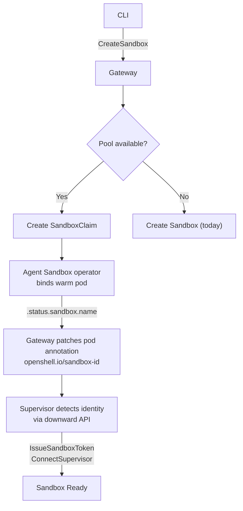

---
authors:
  - "@rhuss"
state: draft
links:
  - https://github.com/NVIDIA/OpenShell/issues/2157
---

# RFC NNNN: Warm Pool Integration for Kubernetes Sandboxes

## Summary

This RFC proposes integrating the Agent Sandbox operator's `SandboxWarmPool` CRD into OpenShell's Kubernetes driver to reduce sandbox startup latency from 16+ seconds to under 4 seconds (Phase 1) and potentially under 2 seconds (Phase 2).

The proposal is based on a feasibility study conducted on a ROSA HCP 4.22.3 cluster with the Red Hat Agent Sandbox operator v0.9.0. Full measurement data, methodology, and limitations are documented in the companion [Results Document](../../experiments/RESULTS.md).

## Motivation

OpenShell's Kubernetes driver provisions a fresh sandbox pod for every `sandbox.create` request. On a typical cluster, this cold-start path takes 16-17 seconds (p50, with pre-pulled images), which is too slow for interactive agent workflows where sub-second tool calls are the norm.

The feasibility study measured the following (see [Results Document](../../experiments/RESULTS.md) for full methodology and caveats):

| Scenario | Image | p50 latency |
|----------|-------|-------------|
| Cold start (OpenShell) | sandbox (3.2 GB, PVC, init, supervisor) | 16,678 ms |
| Cold start (minimal) | pause (700 KB, no PVC, no init) | 2,784 ms |
| Warm pool claim | pause (pre-provisioned) | 2,271 ms |
| **Estimated production warm pool** | **sandbox (idle mode)** | **~3,200 ms** |
| Target | | < 2,000 ms |

The warm pool claim was measured with a minimal `pause` image because the current sandbox image crashes without the supervisor. The estimated production latency of ~3.2s accounts for supervisor startup (1.5s) at claim time. The cold-start breakdown shows that the supervisor itself is fast (1.5 seconds, 8 gRPC calls); most of the 16.7s cold start comes from Kubernetes pod lifecycle (PVC provisioning, scheduling, init containers) which warm pooling eliminates entirely.

## Design

### Architecture Overview



### Key Constraint: Env Var Injection Bypasses Warm Pool

The feasibility study discovered that when a SandboxClaim includes `spec.env` fields, the operator creates a new cold-start pod instead of adopting a warm pool pod. This means env var injection and warm pooling are mutually exclusive in operator v0.9.0.

Identity must be bound through an alternative mechanism. This RFC recommends annotation-based activation via the Kubernetes downward API.

See: [Upstream Issue #384](https://github.com/kubernetes-sigs/agent-sandbox/issues/384) for the proposed file-based injection that would resolve this in a future operator release.

## Changes Required

### 1. Kubernetes Driver (`crates/openshell-driver-kubernetes/`)

#### 1.1 Pool Detection

The driver needs to discover available warm pools in the namespace.

```rust
// New function: check for SandboxWarmPool resources
async fn find_warm_pool(&self, namespace: &str) -> Option<WarmPoolInfo> {
    // List SandboxWarmPool resources
    // Return pool with readyReplicas > 0
    // Match pool's template to requested sandbox profile
}
```

The driver should cache pool availability with a TTL (~30 seconds) to avoid listing SandboxWarmPool resources on every sandbox creation.

#### 1.2 Claim-Based Provisioning Path

When a warm pool is available, the driver creates a SandboxClaim instead of a Sandbox resource.

```yaml
apiVersion: extensions.agents.x-k8s.io/v1beta1
kind: SandboxClaim
metadata:
  name: <sandbox-name>
  namespace: <namespace>
spec:
  warmPoolRef:
    name: <pool-name>
  # NO spec.env (would bypass warm pool)
  # NO additionalPodMetadata (identity injected separately)
```

The claim must NOT include `spec.env` or the operator will fall back to cold-start provisioning.

#### 1.3 Claim Status Monitoring

After creating the SandboxClaim, the driver watches for the Ready condition:

```rust
// Watch SandboxClaim status
// Ready when: .status.conditions[type=Ready].status == "True"
// Bound sandbox: .status.sandbox.name
// No .status.phase field exists in v0.9.0
```

#### 1.4 Identity Injection After Claim

After the claim binds and the sandbox name is known, the driver patches the pod's annotations:

```rust
// Patch pod annotations with sandbox identity
kubectl.patch_pod_annotations(sandbox_name, namespace, {
    "openshell.io/sandbox-id": sandbox_id,
})
```

The supervisor detects this annotation via the downward API and activates.

**User-scoped credentials and token exchange.** When sandboxes act on behalf of a specific user (OBO pattern), the gateway must exchange the user's token for a sandbox-scoped credential at claim time. Annotations are not suitable for carrying sensitive credential material. User-scoped credentials need a separate delivery mechanism: either a Kubernetes Secret created by the gateway and mounted into the pod, or a post-activation gRPC call from the supervisor to `GetSandboxProviderEnvironment` (which already delivers LLM provider credentials). This limitation does not apply to the [gRPC-push approach](../NNNN-warm-pool-grpc-push/README.md), which can deliver identity and user-scoped credentials in a single `ActivateSandbox` call.

In SPIFFE/SPIRE deployments, the SPIRE agent may need to re-attest the warm pod after claim adoption because the pod's attestation properties (annotations, owner references) change. Re-attestation is fast (~10-20ms) but depends on the SPIRE agent detecting the change via the kubelet sync interval.

#### 1.5 Fallback to Cold Start

When the warm pool has zero ready replicas or the SandboxClaim stays Pending for longer than a configurable timeout (default: 5 seconds), the driver falls back to the current cold-start path (creating a Sandbox resource directly).

```rust
match timeout(Duration::from_secs(5), wait_for_claim_ready(&claim)).await {
    Ok(sandbox_name) => { /* warm path */ },
    Err(_) => {
        delete_claim(&claim).await;
        create_sandbox_cold_start(&sandbox).await; // existing path
    }
}
```

#### 1.6 RBAC Requirements

The gateway's ServiceAccount needs additional permissions:

```yaml
# New RBAC rules for warm pool support
- apiGroups: ["extensions.agents.x-k8s.io"]
  resources: ["sandboxclaims"]
  verbs: ["create", "get", "watch", "delete"]
- apiGroups: ["extensions.agents.x-k8s.io"]
  resources: ["sandboxwarmpools"]
  verbs: ["list", "get", "watch"]
- apiGroups: [""]
  resources: ["pods"]
  verbs: ["patch"]  # for annotation injection
```

### 2. Supervisor (`crates/openshell-sandbox/`)

#### 2.1 Idle Mode

The supervisor needs a new startup mode that waits for identity before proceeding with the normal initialization sequence.

```
Entrypoint logic:

if OPENSHELL_SANDBOX_ID is set:
    # Normal cold-start path (unchanged)
    proceed with IssueSandboxToken, config fetch, policy load, connect

else:
    # Warm pool idle mode (new)
    log "Supervisor starting in idle mode, waiting for identity"
    start health check endpoint on :8080 (/healthz -> 200)
    watch /etc/podinfo/annotations for openshell.io/sandbox-id
    when annotation appears:
        set OPENSHELL_SANDBOX_ID from annotation value
        proceed with normal startup sequence
```

#### 2.2 Downward API Annotation Projection

The supervisor reads its own pod's annotations via a projected volume:

```yaml
# Added to the pod spec by the SandboxTemplate
volumes:
- name: podinfo
  downwardAPI:
    items:
    - path: "annotations"
      fieldRef:
        fieldPath: metadata.annotations
```

The supervisor watches `/etc/podinfo/annotations` for changes using `inotify` (Linux) or periodic polling (fallback). When the `openshell.io/sandbox-id` key appears, the supervisor parses its value and begins the activation sequence.

Kubelet propagates annotation changes to projected volumes within the `--sync-frequency` interval (default 60 seconds, configurable). For sub-5-second activation, the cluster should set `--sync-frequency=1s` or the supervisor should use polling with a 500ms interval as a fallback.

#### 2.3 Health Check Endpoint

In idle mode, the supervisor exposes a minimal HTTP health endpoint:

```
GET /healthz -> 200 OK (idle, waiting for identity)
GET /readyz  -> 503 Service Unavailable (not yet activated)
```

After activation, `/readyz` transitions to `200 OK` once SSH is ready. The SandboxTemplate's readiness probe should target `/readyz` so the pool controller knows when the pod is ready for claiming.

### 3. Gateway (`crates/openshell-server/`)

#### 3.1 Pool-Aware Sandbox Creation

The `CreateSandbox` gRPC handler needs a branching path:

```rust
async fn create_sandbox(&self, request: CreateSandboxRequest) -> Result<...> {
    let sandbox_id = Uuid::new_v4();
    let jwt = self.mint_sandbox_jwt(&sandbox_id);

    // Store sandbox as "pending" in the sandbox store
    self.store.insert_pending(sandbox_id, &request.name);

    // Try warm pool first
    if let Some(pool) = self.driver.find_warm_pool(&namespace).await {
        match self.driver.create_claim(&request.name, &pool).await {
            Ok(claim) => {
                let sandbox_name = self.driver.wait_claim_bound(&claim).await?;
                self.driver.inject_identity(&sandbox_name, &sandbox_id).await?;
                // Supervisor will call back via ConnectSupervisor
                return Ok(sandbox_id);
            }
            Err(_) => { /* fall through to cold start */ }
        }
    }

    // Cold-start fallback (existing path)
    self.driver.create_sandbox(&sandbox_id, &request).await
}
```

#### 3.2 Sandbox Store Changes

The sandbox store needs to track the warm pool lifecycle:

```rust
enum SandboxState {
    Pending,       // Created, waiting for compute
    WarmClaimed,   // Claim bound, waiting for supervisor activation
    Connected,     // Supervisor called ConnectSupervisor
    Ready,         // SSH available, sandbox usable
    // ... existing states
}
```

The `WarmClaimed` state is new and represents the window between claim binding and supervisor activation.

### 4. Gateway-Managed Pool Lifecycle

The gateway manages `SandboxTemplate` and `SandboxWarmPool` resources at runtime based on its configuration. This allows flexible multi-image pool management, independent scaling, and future dynamic pool creation without redeployment.

#### 4.1 Gateway Configuration

```toml
# gateway.toml additions
[compute.warm_pools]
enabled = false           # Opt-in, disabled by default
fallback_timeout = "5s"   # Seconds before falling back to cold start

[[compute.warm_pools.pools]]
image = "ghcr.io/nvidia/openshell-community/sandboxes/base:latest"
replicas = 3

[[compute.warm_pools.pools]]
image = "ghcr.io/nvidia/openshell-community/sandboxes/ollama:latest"
replicas = 2
```

At startup, the gateway reconciles the cluster state against this configuration: creating `SandboxTemplate` + `SandboxWarmPool` pairs for each configured image, updating replica counts, and deleting pools that were removed from the config.

#### 4.2 Helm Chart (RBAC only)

The Helm chart provides the RBAC permissions the gateway needs to manage pool resources. It does not create the pool resources themselves.

The ClusterRole for the gateway ServiceAccount needs the additional permissions from section 1.6 (create/get/watch/delete on `sandboxclaims`, `sandboxwarmpools`, `sandboxtemplates`).

#### 4.3 Image Pre-Pull DaemonSet (Optional)

An optional image pre-pull DaemonSet can be deployed alongside the gateway to cache sandbox images on all nodes. See `experiments/manifests/image-prepull-daemonset.yaml`.

### 5. CLI (`crates/openshell-cli/`)

#### 5.1 `--no-connect` Flag

Add a `--no-connect` or `--detach` flag to `openshell sandbox create` that creates the sandbox and exits without opening an SSH session. This is needed for programmatic use and measurement scripts.

#### 5.2 Pool Status in `openshell status`

```
Server Status
  Gateway: k8s
  Server:  https://...
  Status:  Connected
  Version: 0.0.80

Warm Pool
  Pool:     openshell-warm-pool
  Ready:    3/3
  Template: openshell-warm
```

### 6. Gateway Configuration (`gateway.toml`)

New configuration section for warm pool behavior:

```toml
[compute.warm_pool]
# Enable warm pool claim path
enabled = true

# Name of the SandboxWarmPool resource to use
pool_name = "openshell-warm-pool"

# Seconds to wait for claim before falling back to cold start
fallback_timeout_secs = 5

# Seconds to cache pool availability checks
pool_cache_ttl_secs = 30

# Identity injection method: "annotation" (default) or "grpc" (future)
identity_method = "annotation"
```

### 7. Documentation (`docs/`)

#### 7.1 Configuration Reference

Add `[compute.warm_pool]` section to `docs/reference/gateway-config.mdx`.

#### 7.2 Warm Pool Guide

New page: `docs/guides/warm-pool.mdx` covering:
- Prerequisites (Agent Sandbox operator with extension CRDs)
- Enabling warm pool via gateway configuration
- Pool sizing guidance
- Monitoring pool health
- Troubleshooting (pool exhaustion, slow replenishment)

## Implementation Plan

### Phase 1: Claim-Time Supervisor Startup (~3-4s target)

Points use a normalized scale consistent with the [gRPC-push RFC](../NNNN-warm-pool-grpc-push/README.md) so that effort can be compared across approaches: 1 = trivial, 2 = small, 3 = medium, 5 = large.

| Work item | Points | Crate/Component |
|-----------|--------|-----------------|
| Supervisor idle mode + annotation activation | 5 | `openshell-sandbox` |
| K8s driver claim path + cold-start fallback | 3 | `openshell-driver-kubernetes` |
| Gateway pool-aware CreateSandbox | 2 | `openshell-server` |
| Gateway pool reconciler + config | 3 | `openshell-server` |
| Helm chart (RBAC for extension resources) | 1 | `deploy/` |
| CLI `--no-connect` flag | 1 | `openshell-cli` |
| E2E tests on OpenShift | 3 | `tests/` |
| Documentation | 1 | `docs/` |
| **Total** | **~19** | |

### Phase 2: Optimized Startup (~2s target)

| Work item | Points | Depends on |
|-----------|--------|------------|
| Overlap claim binding with supervisor startup | 2 | Phase 1 |
| OPA policy pre-compilation in warm pods | 3 | Phase 1 |
| CLI polling reduction (tighter interval or SSE) | 2 | Independent |
| **Total** | **~7** | Phase 1 |

### Phase 3: Sub-Second Startup (optional)

| Work item | Points | Depends on |
|-----------|--------|------------|
| Supervisor deferred identity mode (gRPC push) | 5 | Phase 1 |
| Gateway warm pod pre-registration | 3 | Phase 1 |
| Hot reconfiguration (policy delta at claim time) | 5 | Deferred identity |
| **Total** | **~13** | Phase 1 |

## Risks and Mitigations

| Risk | Impact | Mitigation |
|------|--------|------------|
| Warm pool exhaustion under burst traffic | Latency spike (fallback to 16s cold start) | Configure pool size >= expected burst rate; driver falls back automatically |
| Kubelet annotation sync delay (up to 60s default) | Supervisor activation delayed | Set `--sync-frequency=1s` or use polling in supervisor |
| Operator upgrades change CRD schema | Driver breaks on field name changes | Abstract CRD field access behind a version-aware adapter |
| Idle pods consume cluster resources | Wasted capacity when sandboxes are not being created | Configurable pool size; can scale to 0 during off-hours |
| Stale warm pods (expired certs, outdated images) | Claimed sandbox has stale state | Operator handles pod rotation; supervisor validates cert freshness on activation |
| Red Hat operator removes/changes `additionalPodMetadata` | Identity injection path breaks | Upstream engagement to stabilize the API; fallback to ConfigMap-based injection |

## Alternatives

### Always-On Supervisor with gRPC-Push Identity Binding

The companion [gRPC-push RFC](../NNNN-warm-pool-grpc-push/README.md) proposes keeping the supervisor running from pool provisioning time. Global OPA policies are pre-compiled at pool time. At claim time, the gateway pushes sandbox identity directly to the supervisor via a new `ActivateSandbox` gRPC endpoint, bypassing the downward API propagation delay entirely. Only sandbox-specific policies compile at claim time.

This approach targets sub-1-second provisioning latency, compared to the ~3-4 seconds achievable with the annotation-based approach described in this RFC. Neither RFC is primary; the choice depends on the latency target and acceptable complexity.

| Dimension | Annotation-based (this RFC) | gRPC-push (companion RFC) |
|-----------|----------------------------|---------------------------|
| **Claim-to-ready latency** | ~3-4s (claim + supervisor startup + downward API) | <1s target (claim + gRPC push + delta OPA) |
| **Supervisor complexity** | Idle-start: new mode that watches annotations, then runs normal startup | Always-on: runs from pool time, two-tier OPA, new gRPC endpoint |
| **Gateway complexity** | Claim creation + annotation patch | Claim creation + pool reconciler + gRPC client + pod IP discovery |
| **OPA compilation** | Full compilation at claim time (~1,400 ms) | Pre-compiled globals at pool time; sandbox-specific delta at claim time (<200 ms) |
| **Security surface** | Standard K8s downward API (no new endpoints) | New gRPC endpoint on supervisor (mTLS-secured) |
| **Upstream alignment** | Matches @craig-kindo's validated GKE implementation ([#1447](https://github.com/NVIDIA/OpenShell/issues/1447)) | Novel approach, not yet validated externally |
| **Resource cost (idle pools)** | Sleeping process (`sleep infinity`), minimal CPU/memory | Running supervisor process, ~100m CPU / 128Mi memory per pod |
| **User-scoped credentials (OBO)** | Separate mechanism needed (Secret mount or post-activation gRPC) | Single `ActivateSandbox` call carries identity + credentials |
| **Implementation effort (Phase 1)** | ~19 points (shippable with ~3-4s latency) | ~24 points (shippable with <1s latency) |

**Incremental adoption path:** The annotation-based approach can be implemented first as Phase 1, with the gRPC-push approach added later as an optimization for workloads requiring sub-second provisioning. The gateway configuration's `identity_method` field can select between the two at runtime.

### Do Nothing

Keep the current cold-start path. Users accept 16+ second startup. This is unacceptable for interactive agent workflows.

### Env Var Injection via SandboxClaim

Use the operator's `envVarsInjectionPolicy: Allowed` to inject identity at claim time. **Rejected** because the operator v0.9.0 bypasses the warm pool when env vars are present, creating a cold-start pod instead. See [upstream Issue #384](https://github.com/kubernetes-sigs/agent-sandbox/issues/384).

### Container Checkpoint/Restore (CRIU)

Snapshot a ready supervisor container and restore it on demand. Avoids pool management entirely. **Deferred** because CRIU support on OpenShift is limited, and the warm pool approach achieves comparable latency with standard Kubernetes primitives.

### Client-Side Sandbox Reuse

Reuse an existing sandbox across multiple tool invocations within the same agent session. Reduces cold-start frequency but does not eliminate it and changes the isolation model. **Complementary** to warm pooling, not a replacement.

## Prior Art

- **Agent Sandbox `SandboxWarmPool` CRD**: The operator's pool implementation, directly evaluated in this study.
- **Knative Cold-Start Mitigation**: Configurable minimum replica count for serverless workloads. Analogous pool pattern.
- **AWS Lambda SnapStart**: Pre-initializes function instances from snapshots. Similar intent, different mechanism.

## Open Questions

1. ~~Should the warm pool be created by the Helm chart (declarative) or by the gateway on first use (imperative)?~~ **Resolved: gateway-managed.** The gateway creates, scales, and deletes pool resources based on its configuration. This enables multi-image pools, independent scaling, and future dynamic pool creation.

2. What is the minimum kubelet `--sync-frequency` that is safe for production clusters? The default of 60 seconds is too slow for annotation-based activation.

3. Should the gateway support multiple warm pools with different resource profiles (e.g., CPU-only vs GPU-attached)?

4. How should pool sizing be determined automatically? A fixed `replicas` count is simple but does not adapt to demand. HPA-based autoscaling of warm pools is a future consideration.

5. ~~Does `additionalPodMetadata` actually patch annotations on an already-bound warm pod?~~ **Verified YES.** Annotations with custom domains (e.g., `openshell.io/sandbox-id`) are applied to the adopted warm pod without container restart. Labels and `agents.x-k8s.io/` domain annotations are rejected by the operator's allowlist.

## References

- [Feasibility Study Results](../../experiments/RESULTS.md): Full measurement data, methodology, cold-start breakdown, and identity binding analysis.
- [GitHub Issue #2157](https://github.com/NVIDIA/OpenShell/issues/2157): Warm pool integration feature request.
- [Agent Sandbox Issue #384](https://github.com/kubernetes-sigs/agent-sandbox/issues/384): Upstream proposal for claim-time env var injection.
- [Agent Sandbox Documentation](https://agent-sandbox.sigs.k8s.io/docs/): CRD reference and getting started guides.
