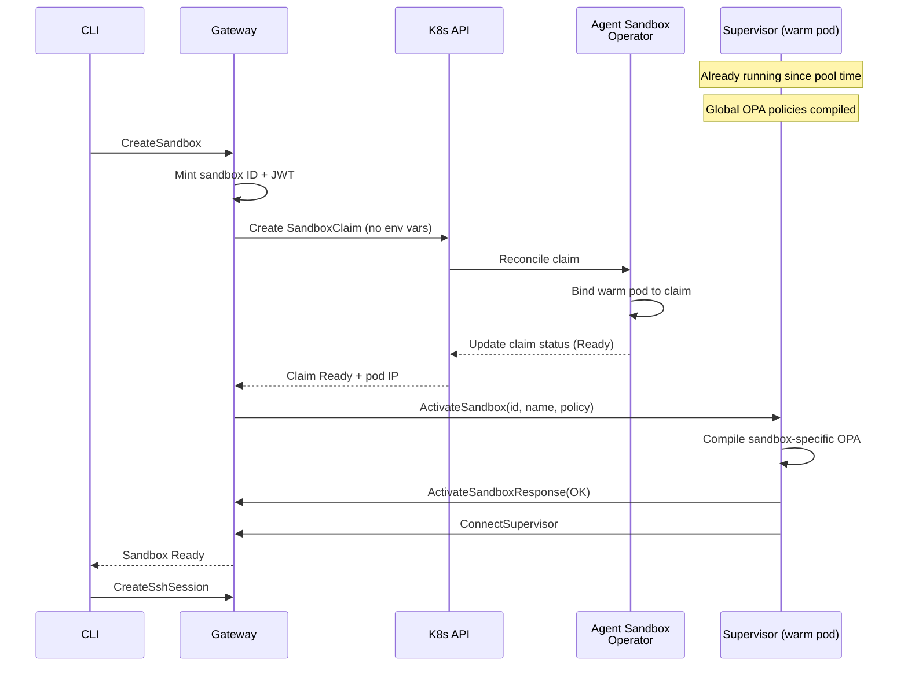
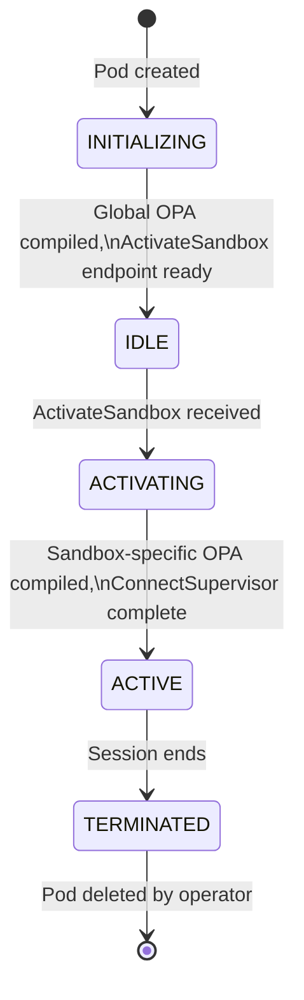

---
authors:
  - "@rhuss"
state: draft
links:
  - https://github.com/NVIDIA/OpenShell/issues/2157
---

# RFC NNNN: Warm Pool Integration with Always-On Supervisor (gRPC-Push)

## Summary

This RFC proposes an alternative warm pool integration for OpenShell's Kubernetes driver that keeps the supervisor process running in warm pool pods from provisioning time. At claim time, the gateway pushes sandbox identity directly to the supervisor via a new `ActivateSandbox` gRPC endpoint, bypassing the Kubernetes downward API propagation delay entirely. Global OPA policies are pre-compiled at pool time; only sandbox-specific policies compile at claim time.

The target is sub-1-second sandbox provisioning (p50), compared to the ~3-4 seconds achievable with the companion [annotation-based RFC](../NNNN-warm-pool-feasibility/README.md). Both RFCs are equal alternatives for different latency targets and complexity appetites.

## Motivation

OpenShell's Kubernetes driver provisions a fresh sandbox pod for every `sandbox.create` request. On a typical cluster, this cold-start path takes 16-17 seconds (p50, with pre-pulled images), which is too slow for interactive agent workflows where sub-second tool calls are the norm.

A feasibility study conducted on two independent ROSA HCP 4.22.3 clusters with the Red Hat Agent Sandbox operator v0.9.0 measured the following (see [Results Document](../../experiments/RESULTS.md) for full methodology and caveats):

| Scenario | Image | p50 latency |
|----------|-------|-------------|
| Cold start (OpenShell) | sandbox (3.2 GB, PVC, init, supervisor) | 16,678 ms |
| Cold start (minimal) | pause (700 KB, no PVC, no init) | 2,784 ms |
| Warm pool claim | full sandbox spec (pre-provisioned) | 2,333 ms |
| Warm pool claim | pause (pre-provisioned) | 2,271 ms |

The cold-start breakdown reveals that the supervisor itself is fast: 1.5 seconds for 8 sequential gRPC calls covering token issuance, configuration retrieval, policy loading, and session registration. Of that 1.5 seconds, ~80 ms is network time and ~1,400 ms is process startup plus OPA policy compilation. The remaining 15+ seconds comes from Kubernetes pod lifecycle (scheduling, PVC provisioning, init containers, image pulls) which warm pooling eliminates entirely.

The annotation-based approach (see companion RFC) starts the supervisor at claim time and delivers ~3-4 seconds end-to-end. This RFC targets sub-1 second by eliminating supervisor startup from the claim-time critical path: the supervisor runs continuously in the warm pod, global policies are already compiled, and identity arrives via direct gRPC rather than through the Kubernetes control plane.

## Non-goals

- **Dynamic pool promotion.** Automatically creating warm pools for previously unseen images is a future extension. The initial design requires explicit pool configuration.
- **Non-Kubernetes compute drivers.** This RFC addresses the Kubernetes driver only. Analogous patterns for Docker (pre-created containers) and VM (snapshot restore) drivers are out of scope.
- **Code implementation.** This RFC describes the design. Implementation details (proto definitions, exact Rust API signatures) are deferred to the implementation phase.
- **Supervisor pre-connection to the gateway.** Pre-registering the supervisor session with the gateway before claim time would further reduce latency but introduces complex lifecycle management. It is excluded from the initial design.
- **Pool autoscaling.** HPA-based scaling of warm pools based on demand is a future optimization, not part of this proposal.

## Proposal

### Architecture Overview

The gRPC-push architecture changes the claim-time flow by removing the Kubernetes downward API from the critical path and replacing it with a direct gRPC call from the gateway to the supervisor.



The key difference from the annotation-based approach: the supervisor is already running and has already compiled global OPA policies. The gateway pushes identity directly to the supervisor's pod IP (read from `.status.sandbox.podIPs` on the SandboxClaim), skipping the 1-2 second downward API annotation propagation delay and the 1.4 second process startup and OPA compilation overhead.

### Always-On Supervisor with Two-Tier OPA Compilation

In the gRPC-push model, the supervisor starts at pool provisioning time, not at claim time. This changes the supervisor lifecycle from a single startup sequence into a two-phase initialization:

**Phase 1: Pool provisioning (before any claim)**

The supervisor starts when the warm pool pod is created. It performs all initialization that does not depend on sandbox identity:

1. Start process, initialize runtime
2. Compile global OPA policies (network rules, filesystem constraints applicable to all sandboxes)
3. Open the `ActivateSandbox` gRPC endpoint
4. Return 200 on `/readyz` to signal the pod is ready for claiming

Global policies are stable across sandbox sessions. They include network egress rules, filesystem access constraints, and process execution policies that apply identically to every sandbox. Pre-compiling them at pool time removes the largest contributor to supervisor startup latency (approximately 1,400 ms of the 1,500 ms total).

**Phase 2: Claim-time activation (after identity push)**

When the gateway pushes sandbox identity via `ActivateSandbox`, the supervisor:

1. Receives sandbox ID, name, and sandbox-specific policy configuration
2. Compiles only the sandbox-specific OPA policy delta (per-sandbox rules, provider-specific constraints)
3. Merges the delta with the pre-compiled global policy bundle
4. Calls `IssueSandboxToken`, `GetSandboxConfig`, and remaining gRPC calls (~80 ms)
5. Calls `ConnectSupervisor` to register the session with the gateway

The sandbox-specific policy delta is expected to be small (a handful of rules compared to the full policy set), so its compilation time should be well under 200 ms.

**Supervisor state machine:**



| State | Description | `/readyz` |
|-------|-------------|-----------|
| INITIALIZING | Supervisor starting, global OPA compiling | 503 |
| IDLE | Global policies compiled, waiting for identity push | 200 |
| ACTIVATING | Received identity, compiling sandbox-specific policies | 200 |
| ACTIVE | Fully activated, SSH ready, serving session | 200 |
| TERMINATED | Session ended, pod will be deleted by operator | 503 |

The `/readyz` endpoint returns 200 in both IDLE and ACTIVATING states so the pod remains Ready in the warm pool. The pool controller uses pool membership, not readiness, to determine claimability.

### gRPC Identity Push Protocol

After the operator binds a claim to a warm pod, the gateway reads the pod IP from `.status.sandbox.podIPs` on the adopted Sandbox resource and pushes sandbox identity to the supervisor.

**Endpoint definition (conceptual):**

```protobuf
service SandboxActivation {
  rpc ActivateSandbox(ActivateSandboxRequest) returns (ActivateSandboxResponse);
}

message ActivateSandboxRequest {
  string sandbox_id = 1;
  string sandbox_name = 2;
  PolicyConfig policy_config = 3;
  map<string, string> provider_environment = 4;
  // User-scoped credentials from OBO token exchange (when sandbox acts on behalf of a user)
  UserCredentials user_credentials = 5;
}

message ActivateSandboxResponse {
  enum Status {
    OK = 0;
    FAILED = 1;
  }
  Status status = 1;
  string error_message = 2;
  google.protobuf.Timestamp ready_at = 3;
}
```

**Security:** The gRPC channel between gateway and supervisor uses the existing namespace mTLS certificates. The TLS client secret volume is already mounted in the warm pod template (the same volume mount used by the cold-start path). No new certificate infrastructure is needed.

**Timeout and retry policy:** The gateway applies a 2-second timeout per `ActivateSandbox` attempt. If the first attempt fails (network error, supervisor crash, TLS handshake failure), the gateway retries once. If both attempts fail, the gateway falls back to cold-start provisioning. This ensures that a crashed warm pod never blocks sandbox creation.

**Pod IP discovery:** The gateway reads the pod IP from the SandboxClaim's `.status.sandbox.podIPs` field after the claim reaches Ready status. This field is populated by the operator when the claim binds to a warm pod. The pod IP is routable from the gateway pod because both run in the same namespace with standard Kubernetes networking.

**User-scoped credentials and token exchange.** When sandboxes act on behalf of a specific user (OBO pattern), the gateway exchanges the user's token for a sandbox-scoped credential at claim time. The `ActivateSandbox` call carries both sandbox identity and user-scoped credentials in a single message (`user_credentials` field), eliminating the need for a separate credential delivery mechanism. This is a key advantage over the annotation-based approach, where annotations cannot carry sensitive credential material and a separate Secret mount or post-activation gRPC call is needed.

In SPIFFE/SPIRE deployments, the SPIRE agent may need to re-attest the warm pod after claim adoption because the pod's attestation properties change. Re-attestation is fast (~10-20ms) and can run in parallel with the `ActivateSandbox` call.

### Gateway-Managed Pool Lifecycle

The gateway owns the lifecycle of SandboxTemplate and SandboxWarmPool Kubernetes resources. Pool configuration is defined in the gateway config file, and the gateway reconciles the cluster state against this configuration at startup.

**Configuration:**

```toml
[[compute.warm_pools]]
image = "ghcr.io/nvidia/openshell-community/sandboxes/base:latest"
replicas = 5

[[compute.warm_pools]]
image = "ghcr.io/nvidia/openshell-community/sandboxes/ollama:latest"
replicas = 2
```

**Startup reconciliation:**

When the gateway starts, it reads the `compute.warm_pools` configuration and reconciles against the namespace:

1. For each configured pool entry, check if a matching SandboxTemplate and SandboxWarmPool exist.
2. If missing, create both resources with the specified image and replica count.
3. If present but with a different replica count, update the SandboxWarmPool's `replicas` field.
4. If a SandboxWarmPool exists in the namespace but has no matching config entry, delete both the pool and its template.

This ensures the cluster state matches the gateway config after every restart. Operators change pool configuration by editing the gateway config and restarting, not by manually managing Kubernetes resources.

**Validation:** The gateway validates the warm pool configuration at startup. Duplicate image entries are rejected. Replica counts must be positive integers. Invalid configurations cause the gateway to fail fast with a clear error message rather than starting with a broken pool state.

**RBAC requirements:**

```yaml
- apiGroups: ["extensions.agents.x-k8s.io"]
  resources: ["sandboxclaims"]
  verbs: ["create", "get", "watch", "delete"]
- apiGroups: ["extensions.agents.x-k8s.io"]
  resources: ["sandboxwarmpools"]
  verbs: ["create", "get", "list", "watch", "update", "delete"]
- apiGroups: ["extensions.agents.x-k8s.io"]
  resources: ["sandboxtemplates"]
  verbs: ["create", "get", "list", "update", "delete"]
```

### Multi-Image Pool Routing and Cold-Start Fallback

The gateway maintains a pool registry mapping container images to their SandboxWarmPool resources. When a sandbox creation request arrives, the gateway looks up the requested image in this registry.

**Pool selection:**

```
For each sandbox creation request:
  1. Resolve the requested image reference
  2. Look up the image in the pool registry
  3. If a pool exists AND has readyReplicas > 0:
     → Create SandboxClaim against that pool (warm path)
  4. If a pool exists BUT has 0 readyReplicas:
     → Fall back to cold-start provisioning
  5. If no pool exists for this image:
     → Fall back to cold-start provisioning
```

**Cold-start fallback on pool exhaustion (FR-007):** When all replicas in a warm pool are claimed and the pool is temporarily empty, the gateway falls back to cold-start provisioning automatically. The user still gets a sandbox, just with higher latency (~16 seconds instead of sub-1 second). When the pool replenishes (the operator creates fresh pods to replace claimed ones), subsequent requests use warm pods again.

**Pool exhaustion is expected under burst load.** The feasibility study confirmed that burst claims of 5 simultaneous requests against a pool of 5 replicas succeed, with the pool replenishing between rounds. If the burst exceeds the pool size, the gateway's fallback path ensures zero sandbox creation failures.

**Unknown images always cold-start.** Custom Dockerfiles, arbitrary image references, and first-time images go through the existing cold-start path. Warm pooling requires a pre-built image with a matching pool configuration.

### Comparison with Annotation-Based Approach

Both this RFC and the [annotation-based RFC](../NNNN-warm-pool-feasibility/README.md) solve the same problem (warm pool integration for reduced sandbox startup latency) with different tradeoffs. Neither is primary. The choice depends on the latency target and acceptable complexity.

| Dimension | Annotation-based (companion RFC) | gRPC-push (this RFC) |
|-----------|----------------------------------|----------------------|
| **Claim-to-ready latency** | ~3-4s (claim + supervisor startup + downward API) | <1s target (claim + gRPC push + delta OPA) |
| **Supervisor complexity** | Idle-start: new mode that watches annotations, then runs normal startup | Always-on: runs from pool time, two-tier OPA, new gRPC endpoint |
| **Gateway complexity** | Claim creation + annotation patch | Claim creation + pool reconciler + gRPC client + pod IP discovery |
| **OPA compilation** | Full compilation at claim time (~1,400 ms) | Pre-compiled globals at pool time; sandbox-specific delta at claim time (<200 ms) |
| **Security surface** | Standard K8s downward API (no new endpoints) | New gRPC endpoint on supervisor (mTLS-secured) |
| **Upstream alignment** | Matches @craig-kindo's validated GKE implementation ([#1447](https://github.com/NVIDIA/OpenShell/issues/1447)) | Novel approach, not yet validated externally |
| **Resource cost (idle pools)** | Sleeping process (`sleep infinity`), minimal CPU/memory | Running supervisor process, ~100m CPU / 128Mi memory per pod |
| **User-scoped credentials (OBO)** | Separate mechanism needed (Secret mount or post-activation gRPC) | Single `ActivateSandbox` call carries identity + credentials |
| **Implementation effort (Phase 1)** | ~19 points (shippable with ~3-4s latency) | ~24 points (shippable with <1s latency) |

**When to choose annotation-based:** The annotation approach is simpler, aligns with an independently validated implementation, and delivers a 4-5x improvement over cold start. It is the lower-risk option for teams that do not need sub-second provisioning.

**When to choose gRPC-push:** The gRPC-push approach targets sub-second provisioning by eliminating all claim-time startup overhead. It is the right choice for workloads where every second of sandbox startup latency matters (high-frequency agent tool calls, interactive development sessions with rapid sandbox cycling).

**Incremental adoption:** The annotation-based approach can be implemented first (Phase 1 in the companion RFC), with the gRPC-push approach added later as an optimization. The gateway configuration's `identity_method` field can select between the two at runtime.

## Implementation Plan

The implementation is phased to deliver incremental value. Phase 1 delivers a shippable warm pool with the always-on supervisor and gRPC-push identity binding (pools created manually or via Helm). Phase 2 adds gateway-managed pool lifecycle automation and multi-image routing.

Points use a normalized scale consistent with the [annotation-based RFC](../NNNN-warm-pool-feasibility/README.md) so that effort can be compared across approaches: 1 = trivial, 2 = small, 3 = medium, 5 = large.

### Phase 1: Shippable Warm Pool with gRPC-Push

| Work item | Points | Crate/Component |
|-----------|--------|-----------------|
| Supervisor always-on mode with two-tier OPA | 5 | `openshell-sandbox` |
| `ActivateSandbox` gRPC endpoint on supervisor | 3 | `openshell-sandbox`, `proto/` |
| Gateway gRPC client for identity push | 3 | `openshell-server` |
| K8s driver claim path + cold-start fallback | 3 | `openshell-driver-kubernetes` |
| Gateway pool-aware CreateSandbox | 2 | `openshell-server` |
| mTLS configuration for gRPC push channel | 1 | `openshell-sandbox`, `openshell-server` |
| Helm chart (template, pool, RBAC) | 2 | `deploy/` |
| Gateway config (`[compute.warm_pool]`) | 1 | `openshell-server` |
| E2E tests on OpenShift | 3 | `tests/` |
| Documentation | 1 | `docs/` |
| **Phase 1 total** | **~24** | |

### Phase 2: Gateway-Managed Pool Automation

| Work item | Points | Crate/Component |
|-----------|--------|-----------------|
| Gateway pool reconciler (create/update/delete pools) | 5 | `openshell-server` |
| Multi-image pool registry and routing | 2 | `openshell-server` |
| Cold-start fallback on pool exhaustion | 1 | `openshell-driver-kubernetes` |
| **Phase 2 total** | **~8** | |

**Combined total: ~32 points.** Phase 1 is shippable with manually created or Helm-managed pools. Phase 2 adds gateway-driven pool lifecycle automation.

## Risks

**New gRPC endpoint surface area.** The `ActivateSandbox` endpoint on the supervisor is a new attack surface. A compromised pod in the same namespace could attempt to push a false identity to a warm pod. Mitigation: the endpoint is mTLS-secured using the existing namespace certificates, and the supervisor validates the caller's certificate against the gateway's identity. The endpoint only accepts calls before activation (IDLE state); once activated, subsequent calls are rejected.

**Gateway complexity increase.** The gateway gains a pool reconciler (Kubernetes resource management), a gRPC client (identity push), and pod IP routing. This is significantly more complex than the annotation-based approach, which requires only a SandboxClaim and an annotation patch. Mitigation: the pool reconciler is a standard Kubernetes controller pattern, and the gRPC client reuses the existing mTLS infrastructure. Both components can be feature-flagged.

**Unvalidated approach.** The annotation-based approach has been validated by @craig-kindo's independent GKE implementation ([#1447](https://github.com/NVIDIA/OpenShell/issues/1447)). The gRPC-push approach is novel and has not been validated externally. Mitigation: the feasibility study confirms the underlying mechanics (warm pool claim binding, pod IP availability). The gRPC-push itself is a straightforward RPC on a known pod IP.

**Resource cost of idle pools.** Always-on supervisors consume more resources than sleeping processes. A pool of 5 replicas with running supervisors uses approximately 500m CPU and 640 Mi memory, compared to negligible resource usage with `sleep infinity`. Mitigation: resource requests for idle supervisors can be set low (100m CPU, 128 Mi memory) since the supervisor does minimal work in IDLE state. Active supervisors can request higher limits via resource overrides at claim time.

**Outdated supervisor binary in warm pods.** If the supervisor image is updated but existing warm pods are not replaced, the running supervisor may have an outdated binary. Mitigation: the SandboxWarmPool's `OnReplenish` update strategy gradually replaces pods as they are claimed and replenished. New pods get the latest image.

**Kubernetes API connectivity loss during pool reconciliation.** If the gateway loses connectivity to the Kubernetes API during startup reconciliation, pool state may be inconsistent. Mitigation: the gateway uses its last-known pool state and retries reconciliation on a backoff interval. Pool reconciliation failures are non-fatal; the gateway can still serve requests using existing pools.

**mTLS certificate expiry.** If the namespace mTLS certificates expire between pool provisioning and claim time, the gRPC push will fail with a TLS handshake error. Mitigation: the same retry/fallback policy applies (2-second timeout, 1 retry, then cold-start fallback). Certificate rotation should be automated with cert-manager or equivalent.

## Alternatives

### Annotation-Based Identity Binding (Companion RFC)

The [annotation-based RFC](../NNNN-warm-pool-feasibility/README.md) proposes starting the supervisor at claim time and injecting identity via Kubernetes pod annotations projected through the downward API. The supervisor detects its identity when the annotation file changes and proceeds with normal startup.

This approach is simpler (no new gRPC endpoint, no gateway pool reconciler) and aligns with @craig-kindo's independently validated GKE implementation. The tradeoff is higher claim-to-ready latency (~3-4 seconds vs sub-1 second) due to supervisor startup and downward API propagation delay. See the [comparison table](#comparison-with-annotation-based-approach) for a detailed breakdown.

### ConfigMap-Based Identity Injection

The gateway creates a ConfigMap with sandbox identity before creating the SandboxClaim. The SandboxTemplate includes a volume mount for this ConfigMap path. After the claim adopts a warm pod, the Kubernetes projected volume propagates the ConfigMap contents into the running container.

Rejected because ConfigMap propagation delay is 60-90 seconds with default kubelet settings, far too slow for interactive use. While configurable via `kubelet --sync-frequency`, this requires cluster-level configuration changes that most operators cannot make.

### Gateway-Native Pool (No Operator Extension CRDs)

The gateway manages its own pool of pre-provisioned Sandbox resources, bypassing the operator's SandboxWarmPool CRD. The gateway creates N sandbox pods at startup and assigns them to incoming requests.

Rejected because it duplicates the Agent Sandbox operator's pool management logic (claim binding, pod rotation, replenishment), which the `SandboxWarmPool` CRD already handles. The Agent Sandbox operator owns the full warm pod lifecycle: it provisions replacement pods when claimed ones are consumed, applies update strategies (`Recreate` vs `OnReplenish`) for template changes, and enforces single-use semantics (each pod serves exactly one session). Re-implementing this in the gateway creates a maintenance burden that grows with every upstream operator release.

### Do Nothing

Keep the current cold-start path. Users accept 16+ second startup latency. This is unacceptable for interactive agent workflows where sub-second tool calls are the norm.

## Prior art

**Agent Sandbox `SandboxWarmPool` CRD.** The Agent Sandbox operator (kubernetes-sigs/agent-sandbox) provides the SandboxWarmPool extension CRD that this RFC builds on. The operator handles pool provisioning, claim binding, pod rotation, and replenishment. The feasibility study validated these mechanics on the Red Hat operator v0.9.0.

**@craig-kindo's GKE warm pool implementation ([OpenShell#1447](https://github.com/NVIDIA/OpenShell/issues/1447)).** An independent implementation that validates the annotation-based approach on GKE, measuring 1.9s p50 claim latency. While this validates the companion RFC's approach rather than the gRPC-push approach, it confirms that the underlying warm pool mechanics work across cloud providers.

**Agent Sandbox operator adoption improvements ([agent-sandbox#1118](https://github.com/kubernetes-sigs/agent-sandbox/pull/1118)).** This upstream PR removes cache-lag requeue deferral during warm pool adoption finalization, reducing claim binding latency. Both the annotation and gRPC-push approaches benefit from this improvement.

**Feasibility study ([experiments/RESULTS.md](../../experiments/RESULTS.md)).** The study conducted on two independent ROSA HCP clusters provides the measurement data, cold-start breakdown, identity binding analysis, and architectural constraints that inform both this RFC and the companion RFC. Key findings: 2.3s claim latency (reproducible), env var injection bypasses warm pool, annotation injection works without container restart, supervisor startup is 1.5s (80ms network + 1,400ms OPA compilation).

## Open questions

1. **Proto definition for `ActivateSandbox`.** The exact protobuf message structure needs to be finalized. The `PolicyConfig` field in `ActivateSandboxRequest` must carry enough information for sandbox-specific OPA compilation without requiring the supervisor to call back to the gateway for additional policy data.

2. **Global vs sandbox-specific OPA policy boundary.** Which OPA policies qualify as "global" (pre-compiled at pool time) and which are "sandbox-specific" (compiled at claim time)? The boundary must be well-defined so that global policy changes trigger pool replenishment while sandbox-specific rules can vary per session.

3. **Image update handling for always-on supervisors.** When a new supervisor image is pushed and the pool template is updated, existing warm pods still run the old binary. The `OnReplenish` strategy handles this gradually, but there may be a window where claimed pods run outdated supervisors. Should the gateway track supervisor versions and prefer newer pods?

4. **Pool reconciler design.** Should the gateway's pool reconciler run as a background loop (periodic reconciliation) or be event-driven (watch SandboxWarmPool status changes)? A background loop is simpler but may have delayed reactions to pool state changes.

5. **Supervisor resource limits at activation.** Should the gateway patch the warm pod's resource limits when pushing identity (increasing from idle-mode limits to active-mode limits)? This would prevent resource contention between idle and active supervisors in the same pool, but adds a pod patch to the critical path.

### Future Extensions

**Dynamic pool promotion.** When the gateway creates a cold-start sandbox for an image that has no pool, it could optionally create a new SandboxTemplate and SandboxWarmPool for that image. This "promotes" a first-seen image into the pool system. A configuration flag would control this behavior:

```toml
[compute.warm_pools]
auto_promote = true
auto_promote_min_replicas = 2
max_pools = 10
```

This trades idle resource cost for latency reduction on subsequent requests with the same image. It is intentionally excluded from the initial design to keep the pool management surface simple and predictable.

## References

- [Feasibility Study Results](../../experiments/RESULTS.md): Full measurement data, methodology, cold-start breakdown, and identity binding analysis.
- [Annotation-Based Warm Pool RFC](../NNNN-warm-pool-feasibility/README.md): Companion RFC proposing annotation-based identity binding with claim-time supervisor startup.
- [GitHub Issue #2157](https://github.com/NVIDIA/OpenShell/issues/2157): Warm pool integration feature request.
- [GitHub Issue #1447](https://github.com/NVIDIA/OpenShell/issues/1447): @craig-kindo's warm pool implementation proposal with GKE validation.
- [Agent Sandbox PR #1118](https://github.com/kubernetes-sigs/agent-sandbox/pull/1118): Operator adoption finalization improvement.
- [Agent Sandbox Issue #384](https://github.com/kubernetes-sigs/agent-sandbox/issues/384): Upstream proposal for claim-time env var injection.
- [Agent Sandbox Documentation](https://agent-sandbox.sigs.k8s.io/docs/): CRD reference and getting started guides.
